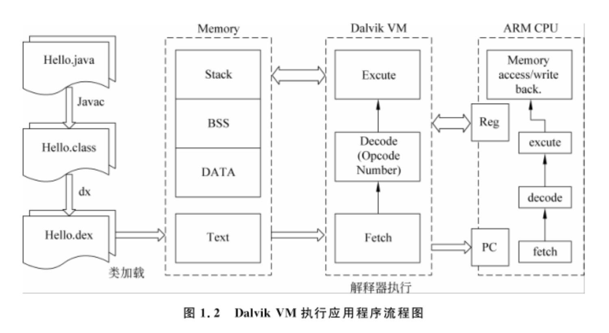
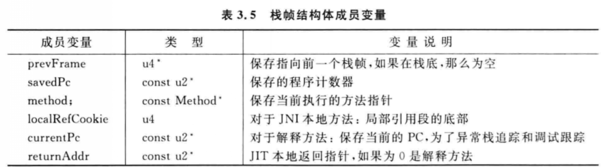
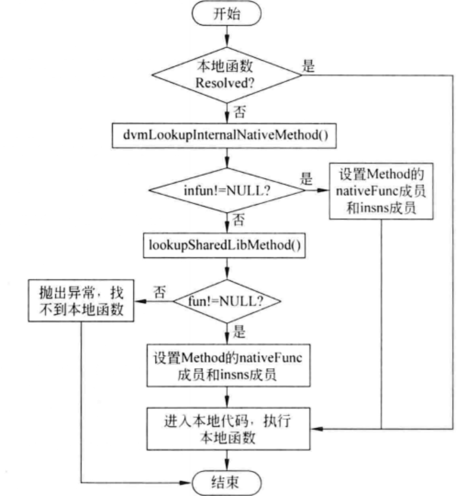
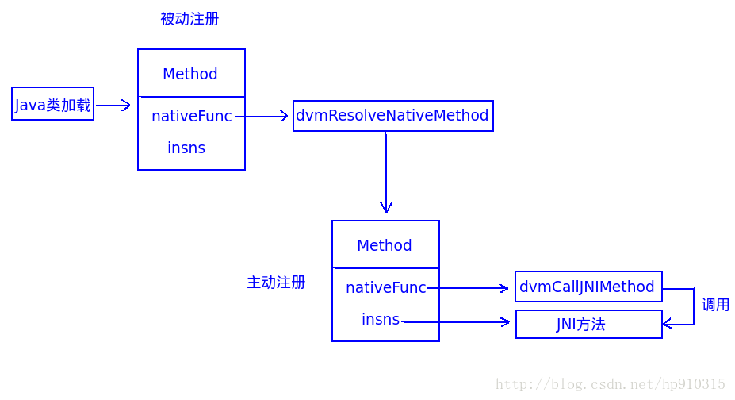
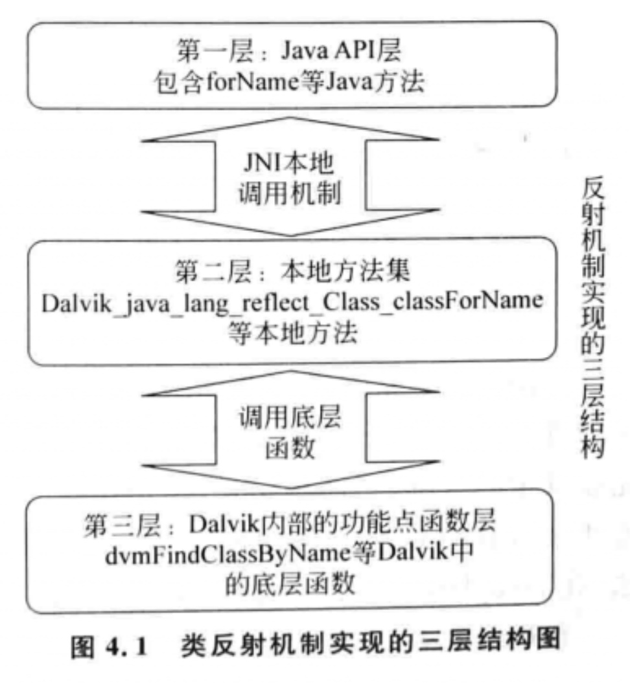

[TOC]


### 一、结构剖析
##### 1、概述
###### 1.1 主要流程
dalvik基于寄存器 减少了load/store之类的内存访问指令

dalvik提供dx工具 用于合并多个class文件并转为基于寄存器的字节码  并优化代码 生成dex文件

VM启动后 将Dex文件被映射到内存区(Text) 解释器将每一条字节码转为本地指令并执行



###### 1.2 主要功能

主要完成对象生命周期、堆栈、线程和安全的管理以及垃圾回收

功能：
1. 进程管理：每一个app都运行在一个VM中，每一个VM都是一个独立的进程
2. Zygote进程管理：Zygote通过复制自身 快速提供一个虚拟机实例
3. 类加载：查找并加载字节码，并将其存入运行时数据结构 供解释器执行
4. 内存管理：内存分配和垃圾回收
5. 本地接口：主要针对c/c++  高效、旧代码复用
6. 反射机制：
7. 解释器：执行引擎 负责解释、执行dex字节码
8. 即时编译：将反复执行的热代码编译为本地代码 提高效率

##### 2、dex文件
字节码指令：https://blog.csdn.net/dd864140130/article/details/52076515
指令格式：https://blog.csdn.net/q327611906/article/details/50012869
dex格式：https://www.jianshu.com/p/f7f0a712ddfe
		https://blog.csdn.net/pxr1989104/article/details/53838176

工具：010Editor

dalvik文件与art文件:https://www.jianshu.com/p/8cd828f30730
Odex文件：dalvik优化的dex文件 (即:将apk中的dex提取出来 再次运行apk时 不需要再提取 直接运行odex 提高运行速度)

##### 3、对象的创建
3.1 遇到new指令时 实现检查参数能否在常量池中定位类的符号引用 并检查是否加载
如果没有加载 则先进行加载
3.2 内存分配分为两种 内存规整则使用指针碰撞(将指针移到未使用的连续区域) 否则使用空闲列表
3.3 初始化内存
3.4 相关设置：gc分代信息等

https://www.jianshu.com/p/f1e5e03ed2f8  (pc端java 知道即可 android上没有)

### 二、模块机制分析
##### 1、类加载模块
类加载器最后生成ClassObject结构体
###### 1.1、Dex文件优化与验证
优化验证工作前置于VM 优化的效果决定了VM是否高效与安全
android4.4版本使用dalvik 在安装时 PMS会将dex文件优化为Odex

###### 1.2、Dex文件解析
将DexFile结构体与Dex文件进行映射 将文件转为内存数据

###### 1.3、运行时环境数据加载+++
加载器从DexFile结构体中查找并提取目标类为ClassObject结构体 ClassObject保存了类的信息

加载分析：https://www.jianshu.com/p/0bff0413fd2f
https://blog.csdn.net/beyond702/article/details/50681453
《android dalvik虚拟机结构及机制剖析 二》  1.5节

##### 2、内存管理
分配规则：
1. 第一次分配内存 如果失败则进行垃圾回收 此次不回收软引用
2. 再次分配内存 失败则增长堆大小(在堆没有到最大时)
3. 启动垃圾回收 此次会回收软引用
4. 如果还是失败 则抛异常

##### 3、JNI模块
dalvik启动过程：https://blog.csdn.net/luoshengyang/article/details/8885792

解释器栈帧：
调用方法时需要压入两个栈帧
一个是break frame它的method为NULL 用于方法返回和异常情况
一个是自身的方法


3.1 java调用c++
https://blog.csdn.net/hp910315/article/details/79273950

insns为指向本地方法的指针
nativeFunc为DalvikBridegFunc的指针
初始状态：nativeFunc=dvmResolveNativeMethod   insns=NULL
如果是内部方法：nativeFunc=jni method   insns=NULL
如果是用户方法：nativeFunc=dvmCallJNIMethod   insns=jni method

dvmCallJNIMethod内部会调用dvmPlatformInvoke 为汇编实现 与平台相关




3.2 c++调用java
JNIEnv定义：`typedef const struct JNINativeInterface* JNIEnv`
定义了FindClass/GetMethodID等JNI操作方法 这些由汇编编写
c调用java 通过JNIEnv里面的方法对ClassObject进行查找并运行 与java调c类似

##### 4、反射机制模块
4.1、主要作用：
1. 运行时判断一个对象所属的类
2. 运行时构造任意一个类的对象
3. 运行时判断一个类所具有的属性和方法
4. 运行时调用任意对象的方法

| 类 | 描述 |
|--------|--------|
|    Class    |    类和接口信息    |
|    Field    |    变量的信息    |
|    Method    |   方法的信息     |
|    Constructor    |   构造的信息     |
|    Array    |     数组的信息   |

4.2、原理
反射主要集中在Class类 主要针对Feild、method、构造、对象、数组
通过native去实现



### 三、参考：
DexClassLoader创建过程: https://www.cnblogs.com/coding-way/p/5212208.html


```java
class DexClassLoader extends BaseDexClassLoader extends ClassLoader {
    public BaseDexClassLoader(String dexPath, File optimizedDirectory,
            String libraryPath, ClassLoader parent) {
        super(parent);
        this.pathList = new DexPathList(this, dexPath, libraryPath, optimizedDirectory);
    }
}
```

DexPathList中由DexFile数组组成 DexFile真正加载dex文件

DexFile由native层做实际的加载操作

加载时 首先判断内存中是否有已经加载好的oat 如果没有 则查找磁盘中是否有已优化好的oat 如果还是没有 则使用dex2oat将dex文件优化为oat 然后由DexClassLoader加载使用 即缓存


待看：
art jni:https://www.cnblogs.com/muhe221/category/709584.html
https://blog.csdn.net/luoshengyang/article/details/39533503