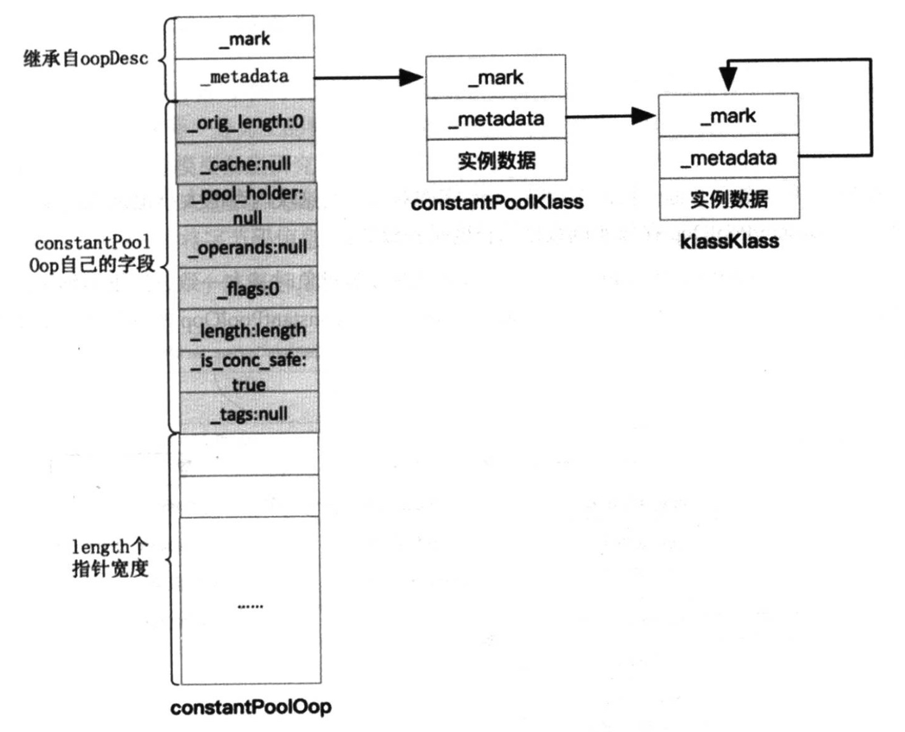

[TOC]

### 一、常量池
每个对象都由对象头和实例数据组成

##### 1、常量池解析
1.1 内存分配
constantPool用于存放常量池的信息

1.2 oop-klass模型
oop：普通对象指针 指向实例数据
klass:包含元数据和方法信息 将class文件映射为内存数据结构 包含元信息视图和虚函数列表(java将每个方法都视为虚方法[vtable普通方法 itable接口方法])

oop内部保存了指向klass的指针  handle封装了oop

每个对象都有头部 用于垃圾回收
oop的metadata指向Klass 可以用于反射等作用

private变量会进行继承 只是在子类中无法使用

### 二、栈帧
###### 1、局部变量表
包括参数和局部变量

###### 2、栈帧
每个方法对应一个栈帧 包含局部变量表 返回地址 操作数栈
一般使用线性栈帧 调用方法即是入栈 方法执行完即是出栈

###### 3、方法
3.1 `<clinit>静态属性/方法初始化与<init>构造初始化`

3.2 vtable 每个对象(instanceKlassOop)都有vtable 用于存储指向非static/非final/非private的函数指针
当子类继承父类时 也会继承父类的vtable 并继续添加子类的方法指针
如果子类重写了父类的方法 则将方法指针更新为子类的实现 即多态

vtable/itable/静态属性 都放在instanceKlass的预留空间中

### 三、类的生命周期
###### 1、类加载器
引导类加载器:c++实现 随jvm启动时启动
扩展类加载器:
系统类加载器:

所有的加载器最终都会使用ClassLoader.loadClass方法加载类(自定义loadClass)除外 保证核心类库由系统加载 自定义加载会有隐患(如自定义Object)

ThreadLocal 分配的内存在eden区 会被gc

CAS是基于cpu的硬件支持

逃逸:一个方法内部创建的对象被外部使用 导致无法被gc回收
逃逸分析很占cpu 一般在jit优化时才启动

loadClass会递归到上一层 继续调用loadClass
defineClass()将class二进制内容转换成Class对象并加载进内存

###### 2、类实例分配
加载类 然后进行解析
解析常量池 生成constancePoolHandle
解析属性 生成FieldHandle
解析方法
创建实例 instanceKlassOop