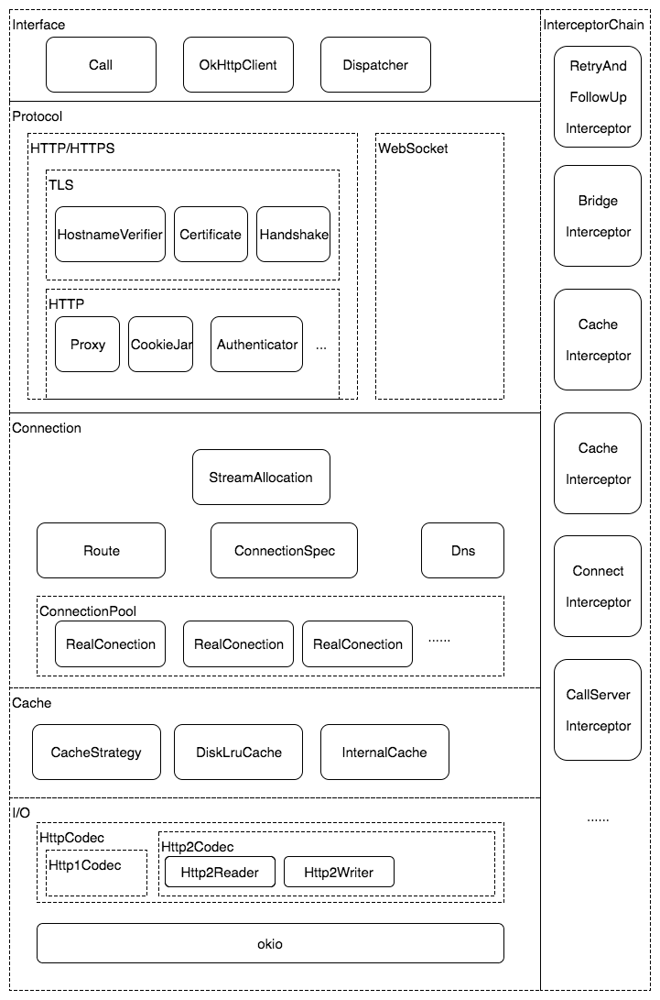

[TOC]


### 一、OKhttp3
https://yq.aliyun.com/articles/78105?spm=a2c4e.11153940.blogcont78101.12.75453cbfTveozs

###### 1、优势
支持HTTPS/HTTP2
内部维护任务队列线程池 支持并发
内部维护连接池，支持多路复用，减少连接创建开销
socket创建支持最佳路由
提供拦截器链

> http1.x：
> 长连接  keep-alive
> 错误通知
> 
> http2.0  在spdy的基础上改进
> 基于二进制 而1.x基于文本
> 多路复用
> header压缩
> 服务端推送
> https://www.cnblogs.com/heluan/p/8620312.html

###### 2、整体结构


**2.1 Interface——接口层：接受网络访问请求**
内部都维护了属于自己的任务队列，连接池，Cache，拦截器等
每一个请求都会封装为一个RealCall  每一个返回的结果处理被封装为AsyncCall
Dispatcher内部维护一个线程池

**2.2 Protocol——协议层：处理协议逻辑**
OkHttp支持Http1/Http2/https协议


**2.3 Connection——连接层：管理网络连接，发送新的请求，接收服务器访问**
内部维护一个socket连接池
HTTP/1.1提出了Keep-Alive机制：请求完一次之后 不释放连接 当再次发送请求时 复用连接  减少创建/释放开销
http/2 双向数据流 可以多个请求交错发送 压缩头部

ConnectionPool为连接池 内部使用connections:Deque<RealConnection>
RealConnection管理socket
HttpCodec:协议的编解码  主要有Http1Codec/Http2Codec
StreamAllocation:创建/复用RealConnection


**2.4 Cache——缓存层：管理本地缓存**
ok的缓存依赖DisLruCache

**2.5 I/O——I/O层：实际数据读写实现**
使用okio实现高效的io操作

**2.6 Inteceptor——拦截器层：拦截网络访问，插入拦截逻辑**

###### 3、源代码

在AsyncCall.getResponseWithInterceptorChain中会添加需要的拦截器类 主要为:
RetryAndFollowUpInterceptor	用于失败重连、重定向
BridgeInterceptor	gzip/cookie/请求头操作
CacheInterceptor	缓存的复用/替换/删除
ConnectInterceptor	创建/复用socket
CallServerInterceptor	发起实际的网络请求
以上类都继承自Interceptor
RealInterceptorChain继承自Interceptor.Chain

```java
//接口类
public interface Interceptor {
  Response intercept(Chain chain);

  interface Chain {
    Response proceed(Request request);
    }
}
//RealInterceptorChain继承
class RealInterceptorChain implements Interceptor.Chain {
    Response proceed(Request request) {
        //new RealInterceptorChain 并使index+1
        RealInterceptorChain next = new RealInterceptorChain(interceptors, index + 1, ...);
        //获取当前的interceptor
        Interceptor interceptor = interceptors.get(index);
        //递归 在Interceptor的实现类中调用chain.proceed
        Response response = interceptor.intercept(next);
    }
}

class RealCall {
Response getResponseWithInterceptorChain() throws IOException {
    List<Interceptor> interceptors = new ArrayList<>();
    //添加自定义应用层拦截器
    interceptors.addAll(client.interceptors());
    //添加重连拦截器
    interceptors.add(retryAndFollowUpInterceptor);
    //添加桥接拦截器
    interceptors.add(new BridgeInterceptor(client.cookieJar()));
    //添加缓存拦截器
    interceptors.add(new CacheInterceptor(client.internalCache()));
    //添加连接拦截器
    interceptors.add(new ConnectInterceptor(client));
    //添加网络层拦截器
    interceptors.addAll(client.networkInterceptors());
    //添加发送拦截器
    interceptors.add(new CallServerInterceptor(forWebSocket));
    //创建Chain实例 并将interceptors传入
    Interceptor.Chain chain = new RealInterceptorChain(interceptors, null, null, null, 0,
        originalRequest, this, eventListener, client.connectTimeoutMillis(),
        client.readTimeoutMillis(), client.writeTimeoutMillis());
	//开始递归调用
    return chain.proceed(originalRequest);
  }
}
```

1 使用时 RealInterceptorChain.proceed内部会再次创建RealInterceptorChain
并将interceptors的下标+1  获取到的Interceptor根据interceptors递增
2 然后获取interceptors的当前拦截器 调用拦截器的intercept方法 并将RealInterceptorChain实例传入
3 在Interceptor会调用chain.proceed 回到第一步

注意事项:
okhttp有应用层拦截器client.interceptors 使用addInterceptor进行添加 可以进行重定向/HEAD动态添加(token请求头)/网络请求日志等
网络层拦截器client.networkInterceptors 使用addNetworkInterceptor 可以进行缓存操作

###### 4、缓存操作
https://www.jianshu.com/p/00d281c226f6
https://www.jianshu.com/p/4550f14338db

强制缓存:如果缓存是有效的，则直接使用缓存
对比缓存:需要和服务器对比 由服务器决定使用缓存还是请求网络

只能缓存GET请求 因为post网络请求更改过于频繁
缓存会缓存响应头以及响应数据

默认有DiskLruCache缓存 但是没有使用
使用cache参数添加缓存文件时 会进行缓存

###### 5、责任链模式
请求与多个处理对象解耦 处理对象可以使用数组或者链表的形式
https://www.cnblogs.com/aeolian/p/8888958.html

### 二、Retrofit
https://www.jianshu.com/p/097947afddaf
https://blog.csdn.net/chunqiuwei/article/details/82596381
###### 1、使用
```java
//创建
Retrofit retrofit = new Retrofit.Builder()
        .baseUrl("http://apis.baidu.com/txapi/")
        .build();
//创建代理
APi api = retrofit.create(APi.class);
//生成一个OKHttpCall的代理对象
Call<ResponseBody> call = api.request(params);
//发起请求
call.enqueue(new Callback() {
    @Override
    public void onFailure(Call call, IOException e) {}

    @Override
    public void onResponse(Call call, Response response) {}
});
```
###### 2、主要类：
RequestFactory	主要将注解解析为请求头
CallAdapter.Factory	okhttp的一个请求任务时一个Call(一个请求) 可以通过桥接模式转换为其他的类(用于桥接网络请求的框架 默认桥接到了Okhttp上)
OkHttpCall		封装了网络请求框架 可以进行自定义
Converter.Factory 用于将返回结果进行转换
ServiceMethod	管理CallAdapter/Converter等

###### 3、整体架构

retrofit整体结构可扩展性强 每一部分都可以灵活定制

###### 3、主要流程


retrofit.create:
使用java代理 进行方法的拦截
主要调用ServiceMethod的方法
解析注解 组成请求头
创建CallAdapter和Converter 并返回CallAdapter转换后的类

call.enqueue:
调用OkhttpCall封装的网络框架 完成请求
在返回时 OkhttpCall会使用Converter将数据进行转换并返回

### 三、eventbus
###### 1、作用
发布订阅模式 可以解耦 以及避免线程的显示切换
大量滥用会导致问题难以定位

###### 2、线程模式
PostThread 默认实现，执行发生在同一个线程
MainThread 执行在UI 线程上
BackgroundThread 回调发生在非 UI 线程上
Async 永远执行在一个其他的线程上

###### 3、使用流程
3.1 EventBus.register时 会通过反射找到注解方法 并存储在 subscriptionsByEventType:Map[Class[?], CopyOnWriteArrayList[Subscription]]中
以传入的类的class为key 注解方法为value

如果是粘滞消息 则注册完之后立即发布事件

3.2 EventBus.post  查找并取出subscriptionsByEventType的方法信息 同时判断线程
如果在相同线程 则使用反射执行方法
如果不同线程 使用handler发到相应线程 使用反射调方法

###### 4、优化
Subscriber Index
android studio可以根据注解生成class文件
避免了通过反射遍历注解 提高了效率

### 四、rxjava
https://www.jianshu.com/p/e1c48a00951a
###### 1、基本使用
```java
//被观察者
Observable.create(new ObservableOnSubscribe<Integer>() {
    @Override
    public void subscribe(ObservableEmitter<Integer> emitter) {
        emitter.onNext(1);
    }
})
//.subscribeOn(Schedulers.newThread())
//.observeOn(AndroidSchedulers.mainThread())
//观察者
.subscribe(new Observer<Integer>() {
    @Override
    public void onSubscribe(Disposable d) {}

    @Override
    public void onNext(Integer integer) {}
});
```

###### 2、基本流程
1 Observable.create 会创建两个对象
创建ObservableOnSubscribe匿名被观察者对象 实现了发送端
创建ObservableCreate 将被观察者对象保存为source

2 subscribe() 创建匿名观察者对象Observer 实现回调
subscribe会调用Observable的实现类ObservableCreate.subscribeActual(Observer[观察者对象])
首先创建parent = CreateEmitter(observer[传入观察者对象])
然后调用source[ObservableCreate].subscribe(parent)
会调用被观察者emitter.onNext()
CreateEmitter.onNext又会调用传入的observer的onNext()
完成调用

简而言之：
```java
被观察者.subscribe(CreateEmitter(观察者[参数]) emitter) {
	emitter.onNext() {	//被观察者实现
    	观察者.onNext()	//观察者实现
    }
}
```

###### 3、线程调度
https://www.jianshu.com/p/ffb5b953c15a
https://blog.csdn.net/gdutxiaoxu/article/details/80577389

| 类型 | 说明 | 应用 |
|--------|--------|---|
|   Schedulers.immediate     |    当前线程    |默认|
|  AndroidSchedulers.mainThread      |  主线程    ||
|  Schedulers.newThread      |    新线程    |耗时操作|
|  Schedulers.io      |   io操作     |网络/文件等|
|  Schedulers.computation      |   cpu密集操作     ||

subscribeOn(Schedulers.newThread())
observeOn(AndroidSchedulers.mainThread())
两者最终调用source.subscribe(parent)
只是会将parent传递到相应线程的run方法中执行

带线程切换时 被观察者会被封装为任务使用线程池执行

###### 4、背压
https://www.jianshu.com/p/ff8167c1d191
1 概述
观察者/被观察者不在同一个线程(会对任务进行缓存) 且被观察者发送事件的速度远大于观察者的处理速度
背压是控制事件流速的策略

2 策略
对于观察者：响应式拉取，即观察者根据自己的实际需求接受事件
对于被观察者:反馈控制，即被观察者根据观察者的接受能力，从而控制发送事件的速度
对于缓存区：对超出缓存区大小的事件进行丢弃，保留，报错。

3 实现
Flowable(被观察者)与Subscriber(观察者)
Flowable是基于Observable的优化 专门解决背压问题 但是效率不高
BackpressureStrategy缓存池策略(抛异常/不接受/丢弃)
背压操作符onBackpressureDrop等

###### 5、补充
除了Observer 还有Subscriber 两个类似
rxjava的转换基于func 因为它有返回值

### 五、RxLifecycle
https://www.jianshu.com/p/0bcf99a4336b
###### 1、概述
解决RxJava使用中的内存泄漏问题 如Rxjava执行耗时任务 activity被finish时导致activity无法被回收

###### 2、流程
RxLifecycle基于rxjava 需要继承RxActvitiy/RxFragment

RxActivity中有继承自Subject的BehaviorSubject对象 在相应的生命周期发送相应的事件
使用时 使用.compose(bindUntilEvent(ActivityEvent.DESTROY))
内部会创建LifecycleTransformer 当收到绑定的生命周期事件时 会调用Observable.takeUntil操作符 取消订阅 并将未发出的清除

.compose(bindToLifecycle())使用take(1)取出最近一次收到的生命周期事件
然后进行转换(CREATE对应DESTROY  START对应STOP)并绑定
与上述流程相同

### 六、glide
http://www.cnblogs.com/guanmanman/p/7008259.html
###### 1、加载框架对比
主流图片框架都支持占位图、错误图展示
支持内存、硬盘缓存
支持图片变换
1.1、Picasso
Square出品
有统计功能 可以知道内存使用率 缓存命中率

1.2、Glide
Google出品
最小化存储开销
最小化解码次数
深度关联生命周期
支持gif
支持扩展特效 模糊/蒙版等
https://github.com/wasabeef/glide-transformations

1.3、Fresco
5.0以下将图片放到匿名共享内存(Native层) 避免OOM(5.0以上在java堆)
失败点击重试
图片渐进式呈现
支持gif

1.4、对比：
glide用于替代Picasso
glide注重平滑的滚动
Fresco内存管理有优势  如果需要处理大量图片 选择Fresco

###### 2、主要类

**总结**:整体架构由挂载机制(数据加载模块、编解码模块组成)、缓存、Engine
挂载模块 使功能解耦 灵活性更好
分级缓存使内存效率更高 分别为activeResource、lrucache、disklrucache
Engine用于统一管理挂载的模块、缓存

2.1 Registry机制
Registry是Glide内部实现的模块挂接中心 实现功能和实现模块的映射 模块之间相互独立

主要有数据加载模块 编解码模块 类型转换模块等 可以灵活添加
https://blog.csdn.net/yxz329130952/article/details/65447772

`prepend(ByteBuffer.class[模块输入], GifDrawable.class[模块输出], byteBufferGifDecoder[模块])`

2.2 ModelLoader机制
https://blog.csdn.net/yxz329130952/article/details/65447784

用于文件/流/字节加载的核心类

ModelLoader的实现类用于对外使用 添加在Registry中 DataFetcher的实现类用于处理具体的数据加载
glide内部使用这种方式进行网络图片的加载

2.3 LoadPath
LoadPath内部包装了多个DecodePath DecodePath专门负责解码和转换(byte转为bitmap等) 通过dataType和resourceType在Registry中查找获得
DecodePath中有解码和转换类
```java
class LoadPath[Data, ResourceType, Transcode] {
	List[DecodePath] decodePaths;
    load() {
    	for(DecodePath path:decodePaths) {
        	path.decode();
        }
    }
}

class DecodePath {
	//负责解码
	List[ResourceDecoder] decoders;
    //负责转换
    ResourceTranscoder transcoder;
    decode() {
    	for(ResourceDecoder decoder:decoders) {
        	result = decoder.decode();
        }
        transcoder.transcode(result)
    }
}
```

2.4 DecodeJob
https://blog.csdn.net/yxz329130952/article/details/65447800
集数据加载、解析和回调通知于一体的包装内 是Glide内实现数据加载功能的中枢

DecodeJob类主要有两个功能：
根据缓存策略 查找合适的DataFetcherGenerator(用于加载数据 内部使用ModelLoader机制)
可以从缓存获取 也可以从网络获取

调用runLoadPath 内部使用LoadPath进行解码和转换


2.5 Engine
初始化主要的类 主要属性：
Key 唯一标识
Resource 封装了相应的资源 如bitmap drawable等
MemoryCache	内存缓存 使用Lru算法
DiskCache	磁盘缓存 封装了DisLruCache
ActiveResources 缓存Request请求的资源？？？
EngineJob 	数据加载
Jobs 		缓存EngineJob

2.6 缓存
https://blog.csdn.net/nbsp22/article/details/80666291
内存缓存有两级：
ActiveResources	未被clear的资源 如果clear将放入MemoryCache 这个缓存相对较小 命中率更高 使用HashMap存储
MemoryCache	LruCache缓存 被命中则移到ActiveResources
磁盘缓存使用DiskCache 将key分为两级：
ResourceCacheKey	缓存已经转码后的资源(bitmap drawable)
DataCacheKey		缓存原始数据(网络请求完成即缓存)

2.6.2 资源加载策略
1. 检查ActiveResources
2. 检查MemoryCache
3. 构造或复用EngineJob 加载资源 顺序为ResourceCacheGenerator(从缓存获取加码后的数据 内存) -> DataCacheGenerator(从缓存获取原始数据 磁盘) -> SourceGenerator(网络请求)
4. SourceGenerator加载完成后 缓存在DataCacheKey 然后经过解码 使用ResourceCacheKey进行缓存
5. 解码后的数据切换到主线程 会构建EngineResource 用于ActiveResources的缓存
6. 缓存完成后交给View进行展示
7. MemoryCache只缓存ActiveResources.clear的资源


###### 3、流程
```java
Glide.with(MainActivity.this).load("url").into(ImageView);
```
3.1 with()
主要初始化Glide和管理生命周期
可以传入
Activity/FragmentActivity	会创建一个空Fragment用于关联生命周期
Fragment	获取activity 并创建一个空Fragmnet
Context或者不在主线程 则使用ApplicationContext

最后使用ActivityFragmentLifecycle管理生命周期的回调

3.2 load
创建RequestBuilder 并将url保存为model

3.3 into
使用DecodeJob 从网络加载/缓存获取图片数据
并将图片赋值给ImageView

### 七、缓存
###### 1、LruCache
https://www.jianshu.com/p/e7843dc350ae
最近最少使用算法 基于LinkedHashMap 为内存缓存
新插入的元素或者最近使用的元素放在队尾 如果内存满 则删除队首的元素

```java
//获取当前可用的内存
int maxMemory = (int) (Runtime.getRuntime().totalMemory()/1024);
//一般使用八分之一作为缓存
int cacheSize = maxMemory/8;
//初始化 统一以kb为单位
mMemoryCache = new LruCache<String,Bitmap>(cacheSize){
    @Override
    protected int sizeOf(String key, Bitmap value) {
        return value.getRowBytes()*value.getHeight()/1024;
    }
};
```

###### 2、DisLruCache
https://www.jianshu.com/p/b282140acc20
1、整体
为磁盘缓存 首选外部内存/storage/emulated/0/Android/data/package_name/cache
如果内存满或被移除
则使用内部缓存/data/data/package_name/cache

DisLruCache文件分为两部分
一部分为journal 日志文件 记录了key 文件长度(一个key可以对应多个文件) 缓存文件名以key命名
一部分为缓存文件

文件有四种状态：
CLEAN 	表示没有对文件进行操作
DIRTY	正在被修改
REMOVE	文件被删除
READ	正在读取文件

2.2、缓存流程
打开时 将日志文件映射为LinkedHashMap
如果内存超过最大值 则根据最近最少原则删除文件 lruEntries/journal文件/缓存文件将同步操作(读不需要)
如果日志文件过大 会重新构建journal文件

```java
mDiskLruCache = DiskLruCache.open()
//写操作
editor = mDiskLruCache.edit(key);
OutputStream outputStream = editor.newOutputStream(0);
使用outputStream进行写操作
editor.commit();	//需要提交 同步日志文件

//读操作
DiskLruCache.Snapshot snapshot = mDiskLruCache.get(key)
InputStream is = snapshot.getInputStream(0)
使用InputStream进行读操作
```

### 八、aroute
基本使用：https://www.jianshu.com/p/6021f3f61fa6
流程：https://www.jianshu.com/p/bc4c34c6a06c
###### 1、注解处理器
https://www.jianshu.com/p/50d95fbf635c
javac在编译时会扫描注解 可以在编译时通过处理器动态生成java文件 一起编译进代码中
需要两步：
继承AbstractProcessor 用于代码编写
注册到javac中 可以使用jar包注册 谷歌提供了注解处理器 两种方式

可以使用javapoet第三方动态生成java文件

###### 2、主要流程
项目在编译时 会将Router注解通过注解处理器生成`Arouter$$Group$$路径.java` 里面存放了Router注解的Activity/Fragment信息
在Arouter.init时进行加载 保存在Warehouse.groupsIndex中

Arouter.build().navigation
build方法会将传入的路径分割 并保存在Postcard中
navigation最终会回调到_Arouter.navigation 首先使用path在groupsIndex查找Activity/Fragment的类信息
如果是activity 则使用Intent进行跳转
如果是Fragment 则使用反射创建新的实例


对于传值 使用Autowired注解的属性会生成Autowired.java文件
发送端通过Bundle传出 接收端通过获取bundle中对应的值 直接赋值给接收端


