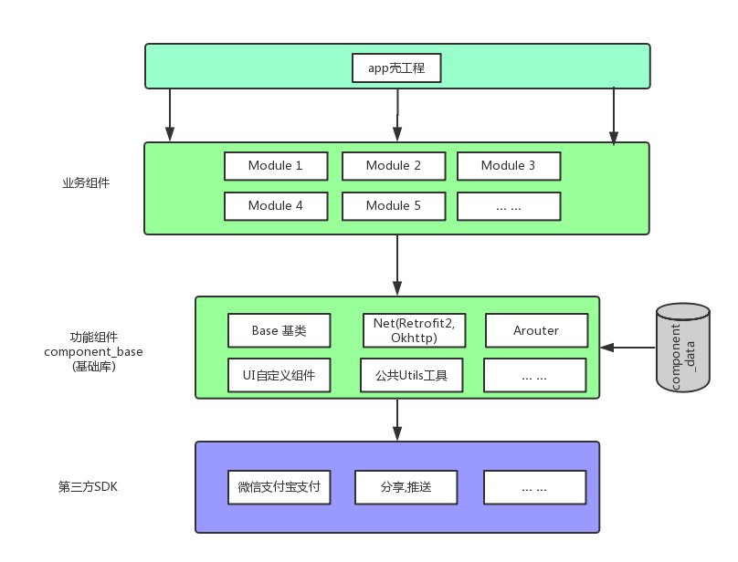

[TOC]


### 一、设计模式

一切设计模式/框架都是围绕可复用、可扩展、可维护

##### 1、原则
单一职责模式:一个类/方法只做一件事
复杂度低 可维护 降低变更风险
类膨胀

里氏替换原则:子类可以在任何地方替代父类
可复用性/扩展性高
增加耦合(必须考虑父类的属性/方法)

依赖倒置:依赖接口 而不是具体的实现
减少类间的耦合性，提高稳定性

接口隔离:如果接口过多 可以进行拆分
继承时 不需要实现的类过多会臃肿

迪米特法则:最少知道
低耦合 高内聚

开闭原则:总的原则
扩展开放 修改关闭

##### 2、常用模式
###### 2.1 建造者模式
优势:
封装性 不用知道内部的所有组成细节 只关注一部分
容易扩展
可定制性强

应用:
okhttp	glide等使用

###### 2.2 工厂模式
优势：
代码结构清晰 有效的封装变化
对调用者屏蔽具体的产品类  降低耦合(迪米特法则)
可扩展性强

应用：
glide挂载的功能模块

2.2.1 简单工厂模式
简单的将产品类进行封装
只有一个工厂(没有工厂接口) 多个产品
降低耦合

2.2.2 工厂模式
多个工厂 多个产品 (工厂、产品都有接口)
可扩展性更强

2.2.3 抽象工厂
将工厂分为大类 每个大类的工厂又分为很多小类 形成不同的类族
对于产品等级结构的划分很重要

可扩展性好 但是相对复杂

###### 2.3 模板模式
优势：
容易扩展
便于维护
代码复用

应用:
android补间动画
view.onDraw方法(每种控件实现不同)

###### 2.4 代理模式
优势：
职责清晰(真正的业务类只关心页面 不需要考虑对外接口)
高可扩展性

应用：
binder

分类：
普通代理
动态代理(反射)
虚拟代理(用到时才实例化代理 类似懒加载)

###### 2.5 责任链模式
优势：
将请求和处理分开 请求不用关心谁处理 处理着也不用关心请求的全貌
劣势：
每个请求从头到尾 如果链太长 性能不好
易于扩展 可以添加节点

应用：
okhttp

事例:
https://www.cnblogs.com/aeolian/p/8888958.html

###### 2.6 装饰者模式
优势：
装饰者类和被装饰类可以相互独立
继承的替代方案
动态扩展一个类的功能

劣势：
多层装饰使类更加复杂 增加调试难度

应用：
ByteArrayInputStream，FileInputStream

###### 2.7 适配器模式
优势：
原本两个互不相关的类一起运行
提高类的复用度
灵活性好

应用：
ListView  Adapter

###### 2.8 组合模式
优势：
高层模块使用简单(树枝/树叶实现相同接口 调用时不用进行区分)
节点容易添加

应用：
文件/文件夹的结构
View/ViewGroup结构

##### 2、单例模式
```java
/**
 * 懒汉 线程不安全
 * */
class Singleton {
    private static Singleton instance;
    private Singleton (){}

    public static Singleton getInstance() {
        if (instance == null) {
            instance = new Singleton();
        }
        return instance;
    }
}

/**
 * 懒汉 加锁
 * 需要加锁的机会不多 效率较低
 * */
class Singleton {
    private static Singleton instance;
    private Singleton (){}
    public static synchronized Singleton getInstance() {
        if (instance == null) {
            instance = new Singleton();
        }
        return instance;
    }
}

/**
 * 饿汉 线程安全
 * 实例只有一份 无论多少线程取 都是一份
 * */
class Singleton {
    private static Singleton instance=new Singleton();
    private Singleton(){}
    public static Singleton getInstance(){
        return instance;
    }
}

/**
 * 静态内部类		重点
 * SingletonHolder被使用时 才会被加载
 * 实现了懒加载的饿汉模式
 * */
class Singleton {
    private static class SingletonHolder {
        private static final Singleton INSTANCE = new Singleton();
    }
    private Singleton (){}
    public static final Singleton getInstance() {
        return SingletonHolder.INSTANCE;
    }
}

/**
 * 枚举
 * 推荐的方式 用的较少
 * 可以避免反射 以及保证序列化/反序列化的实例相同
 * */
enum Singleton {
    INSTANCE;
    public void whateverMethod() {
    }
}

/**
 * 双重检测
 * */
class Singleton {
    private volatile static Singleton singleton;
    private Singleton (){}
    public static Singleton getSingleton() {
        if (singleton == null) {
            synchronized (Singleton.class) {
                if (singleton == null) {
                    singleton = new Singleton();
                }
            }
        }
        return singleton;
    }
}
```

### 二、框架模式
##### 1、mvc
c:controller 基于activity/fragment的生命周期
项目过于复杂时 controller会过于庞大

##### 2、mvp
在p层做网络请求 并将数据通过view回调到activity做相应处理
减轻了activity/fragment的压力 但是会增加很多接口

https://www.tianmaying.com/tutorial/AndroidMVC
将具体网络请求放在M层
业务放在P层  业务过多会臃肿
V层用于回调

##### 3、mvvm
view和model双向绑定 web端用的较多
android提供data binding 效果不好 且谷歌不再支持

### 三、组件化
###### 1、由来
随着业务越来越庞大 模块/人员增多 项目的开发、维护、人员协调难度增加
编译、打包、测试更加耗时
项目模块间的耦合增加 影响效率

###### 2、方案


| 模块 | 作用 |
|--------|--------|
|    app壳工程    |    壳所有业务组件 组成完整app    |
| 模块组件 | 多个业务组成一个模块(我的、首页等) |
| 业务组件 | 根据业务 独立形成的工程 |
| 功能组件 | 网络/图片处理等基础功能<br/> 一般封装于common中 |

每个组件相互独立 业务/模块组件可以独立运行(通过配置Manifest文件com.android.application/com.android.library)
使用maven进行托管

###### 3、补充
3.1 组件间的跳转 推荐ARouter 可以进行activity/fragment间的跳转/传值
3.2 资源冲突 提取公共资源 或者给资源加前缀
3.3 butterKnife冲突 使用8.4版本 使用R2替代R
3.4 统一版本/公共第三方管理


### 四、插件化/热修复

### 五、框架设计(面)
##### 1、设计一个图片加载框架