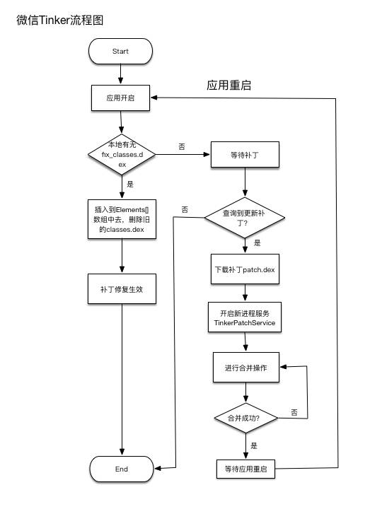

[TOC]


##### 二、主流热修复介绍

###### 2.1 概述
- 热更新有两种使用方式：热修复 如Tinker、插件化 如DroidPlugin
- 热修复两大流派：Native方式，主要是阿里系。java方式，主要是腾讯系
- 难点：资源文件的替换、so文件的替换、AndroidManifest.xml文件

###### 2.3 Tinker原理
**原理**:BaseDexClassLoader有DexPathList  用于维护dexElements数组 dexElements加载dex文件 映射为DexFile
补丁包插入dexElements数组最前面即可


2.3.1：类加载
Tinker是基于QZONE进行开发的，代码修复是利用类加载

android一般使用DexClassLoader去加载dex文件
```java
//BaseDexClassLoader
public BaseDexClassLoader(String dexPath, File optimizedDirectory,
        String libraryPath, ClassLoader parent) {
    super(parent);
    this.pathList = new DexPathList(this, dexPath, libraryPath, optimizedDirectory);//创建一个DexPathList的实例
}

protected Class<?> findClass(String name) throws ClassNotFoundException {
    List<Throwable> suppressedExceptions = new ArrayList<Throwable>();
    Class c = pathList.findClass(name, suppressedExceptions); // 调用DexPathList中的findclass方法
    return c;
}


// DexPathList
public Class findClass(String name, List<Throwable> suppressed) {
    for (Element element : dexElements) {
        DexFile dex = element.dexFile;
        if (dex != null) {
           Class clazz = dex.loadClassBinaryName(name, definingContext, suppressed);
            if (clazz != null) {
                return clazz;
            }
        }
    }
    if (dexElementsSuppressedExceptions != null) {
        suppressed.addAll(Arrays.asList(dexElementsSuppressedExceptions));
    }
    return null;
}
```

BaseDexClassLoader 的构造函数中创建一个DexPathList实例，DexPathList的构造函数会创建一个dexElements 数组,BaseDexClassLoader 在findclass方法中调用了pathList.findClass，这个方法中会遍历dexpathlist中的dexElements数组，然后初始化DexFile，如果DexFile不为空那么调用DexFile类的loadClassBinaryName方法返回Class实例。
ClassLoader在加载到正确的类之后就会停止加载此类,因此我们将包含正确的类的Dex文件中插入在dexElements数组前面就可以完成对问题类的修复


2.3.2 差分包
Tinker进行热修复的流程为：
新dex与旧dex通过dex差分算法生成差异包 patch.dex
将patch dex下发到客户端，客户端将patch dex与旧dex合成为新的全量dex
将合成后的全量dex 插入到dex elements前面，完成修复

Tinker用的差分算法是他们自己完成的。

2.3.3 Tinker的加载代码
应用的入口为TinkerApplication，在onBaseContextAttached()调用了loadTinker()
```java
private static final String TINKER_LOADER_METHOD   = "tryLoad";

private void loadTinker() {
        try {
            //reflect tinker loader, because loaderClass may be define by user!
            Class<?> tinkerLoadClass = Class.forName(loaderClassName, false, getClassLoader());
            Method loadMethod = tinkerLoadClass.getMethod(TINKER_LOADER_METHOD, TinkerApplication.class);
            Constructor<?> constructor = tinkerLoadClass.getConstructor();
            tinkerResultIntent = (Intent) loadMethod.invoke(constructor.newInstance(), this);
        } catch (Throwable e) {
            //has exception, put exception error code
            tinkerResultIntent = new Intent();
            ShareIntentUtil.setIntentReturnCode(tinkerResultIntent, ShareConstants.ERROR_LOAD_PATCH_UNKNOWN_EXCEPTION);
            tinkerResultIntent.putExtra(INTENT_PATCH_EXCEPTION, e);
        }
    }
```
进入TinkerLoader的tryLoad()方法中，
```java
@Override
    public Intent tryLoad(TinkerApplication app) {
        Intent resultIntent = new Intent();

        long begin = SystemClock.elapsedRealtime();
        tryLoadPatchFilesInternal(app, resultIntent);
        long cost = SystemClock.elapsedRealtime() - begin;
        ShareIntentUtil.setIntentPatchCostTime(resultIntent, cost);
        return resultIntent;
    }
```
在tryLoadPatchFilesInternal
-->TinkerDexLoader.loadTinkerJars
-->SystemClassLoaderAdder.installDexes
```java
public static void installDexes(Application application, PathClassLoader loader, File dexOptDir, List<File> files)
        throws Throwable {
        Log.i(TAG, "installDexes dexOptDir: " + dexOptDir.getAbsolutePath() + ", dex size:" + files.size());

        if (!files.isEmpty()) {
            files = createSortedAdditionalPathEntries(files);
            ClassLoader classLoader = loader;
            if (Build.VERSION.SDK_INT >= 24 && !checkIsProtectedApp(files)) {
                classLoader = AndroidNClassLoader.inject(loader, application);
            }
            //because in dalvik, if inner class is not the same classloader with it wrapper class.
            //it won't fail at dex2opt
            if (Build.VERSION.SDK_INT >= 23) {
                V23.install(classLoader, files, dexOptDir);
            } else if (Build.VERSION.SDK_INT >= 19) {
                V19.install(classLoader, files, dexOptDir);
            } else if (Build.VERSION.SDK_INT >= 14) {
                V14.install(classLoader, files, dexOptDir);
            } else {
                V4.install(classLoader, files, dexOptDir);
            }
            //install done
            sPatchDexCount = files.size();
            Log.i(TAG, "after loaded classloader: " + classLoader + ", dex size:" + sPatchDexCount);

            if (!checkDexInstall(classLoader)) {
                //reset patch dex
                SystemClassLoaderAdder.uninstallPatchDex(classLoader);
                throw new TinkerRuntimeException(ShareConstants.CHECK_DEX_INSTALL_FAIL);
            }
        }
    }
    
    private static final class V23 {

        private static void install(ClassLoader loader, List<File> additionalClassPathEntries,
                                    File optimizedDirectory)
            throws IllegalArgumentException, IllegalAccessException,
            NoSuchFieldException, InvocationTargetException, NoSuchMethodException, IOException {
            /* The patched class loader is expected to be a descendant of
             * dalvik.system.BaseDexClassLoader. We modify its
             * dalvik.system.DexPathList pathList field to append additional DEX
             * file entries.
             */
            Field pathListField = ShareReflectUtil.findField(loader, "pathList");
            Object dexPathList = pathListField.get(loader);
            ArrayList<IOException> suppressedExceptions = new ArrayList<IOException>();
            ShareReflectUtil.expandFieldArray(dexPathList, "dexElements", makePathElements(dexPathList,
                new ArrayList<File>(additionalClassPathEntries), optimizedDirectory,
                suppressedExceptions));
            if (suppressedExceptions.size() > 0) {
                for (IOException e : suppressedExceptions) {
                    Log.w(TAG, "Exception in makePathElement", e);
                    throw e;
                }

            }
        }

        /**
         * A wrapper around
         * {@code private static final dalvik.system.DexPathList#makePathElements}.
         */
        private static Object[] makePathElements(
            Object dexPathList, ArrayList<File> files, File optimizedDirectory,
            ArrayList<IOException> suppressedExceptions)
            throws IllegalAccessException, InvocationTargetException, NoSuchMethodException {

            Method makePathElements;
            try {
                makePathElements = ShareReflectUtil.findMethod(dexPathList, "makePathElements", List.class, File.class,
                    List.class);
            } catch (NoSuchMethodException e) {
                Log.e(TAG, "NoSuchMethodException: makePathElements(List,File,List) failure");
                try {
                    makePathElements = ShareReflectUtil.findMethod(dexPathList, "makePathElements", ArrayList.class, File.class, ArrayList.class);
                } catch (NoSuchMethodException e1) {
                    Log.e(TAG, "NoSuchMethodException: makeDexElements(ArrayList,File,ArrayList) failure");
                    try {
                        Log.e(TAG, "NoSuchMethodException: try use v19 instead");
                        return V19.makeDexElements(dexPathList, files, optimizedDirectory, suppressedExceptions);
                    } catch (NoSuchMethodException e2) {
                        Log.e(TAG, "NoSuchMethodException: makeDexElements(List,File,List) failure");
                        throw e2;
                    }
                }
            }

            return (Object[]) makePathElements.invoke(dexPathList, files, optimizedDirectory, suppressedExceptions);
        }
    }
```



从流程图来看，同样可以很明显的找到这种方式的特点：

优势：
- 合成整包，不用在构造函数插入代码，防止verify，verify和opt在编译期间就已经完成，不会在运行期间进行
- 性能提高。兼容性和稳定性比较高。

- 开发者透明，不需要对包进行额外处理。

不足：

- 不支持即时生效，必须通过重启应用的方式才能生效。

- 需要给应用开启新的进程才能进行合并，并且很容易因为内存消耗等原因合并失败。

- 合并时占用额外磁盘空间，对于多DEX的应用来说，如果修改了多个DEX文件，就需要下发多个patch.dex与对应的classes.dex进行合并操作时这种情况会更严重，因此合并过程的失败率也会更高。

- 应用启动时虚拟机会进行dexopt操作，将patch.dex文件转换成odex文件，这个过程非常耗时。而这个过程，又要求需要在主线程中，以同步的方式执行，可能会造成ANR问题

参考：
Tinker资源加载：https://www.jianshu.com/p/3fd9789751bc
https://mp.weixin.qq.com/s/uY5N_PSny7_CHOgUA99UjA?spm=a2c4g.11186623.2.5.bX62n5
https://www.jianshu.com/nb/11828881

###### 2.4 阿里热修复
2.4.1 热修复原理
将底层Method的指针指向补丁包中的方法

2.4.2 冷修复
插入补丁包dex文件 并将旧dex文件相关的类删除掉
虚拟机查找时 就会找补丁包中的dex文件

2.4.3 资源替换
系统的资源使用AssetManager管理 在android5.0之后 直接使用addAssetPath可以将补丁资源加载
在之前 需要替换AssetManager 将package id由0x7f(系统默认的)  替换为0x66 可以使apk使用替换后的资源

2.4.4 so文件替换
*动态注册*
art下直接注册即可
dalvik下需要给so文件改名 因为会以so文件的名字做key 如果已经加载过就不会再加载

*静态注册*
先解注册native方法 再加载

因为加载so文件 如果dex没有相应的java方法 会直接报错 所有热更新局限太大 被放弃

*System.loadLibrary*
如果有补丁so 则加载补丁
如果没有补丁 则加载原来的so
缺点 混淆的so文件很难加载

*反射注入*
虚拟机加载so文件时 是通过路径查找的 将补丁so的路径通过反射的方式注入即可

一般使用反射注入的方式