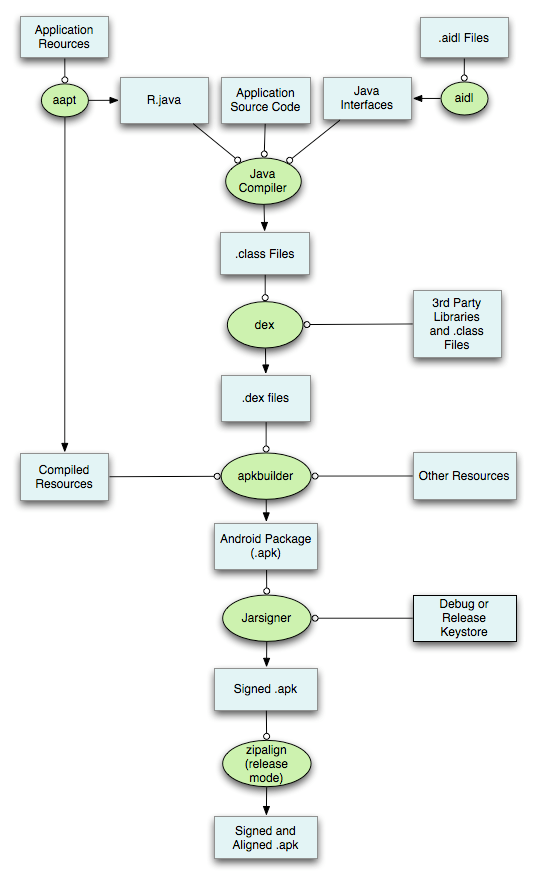

[TOC]

### 一、打包相关
##### 1、打包流程

| 工具 | 功能 |
|--------|--------|
|    aapt    |    打包res 生成R.java、resources.arsc/res文件    |
| aidl | aidl文件生成java接口|
| javaCompiler | java文件生成class文件 |
| dex |	将class和第三方库中的class文件生成classes.dex |
| apkbuilder | dex文件/resources.arsc/assets/Manifest打成apk包 |
| Jarsigner | apk进行签名 |
| zipalign | 字节对齐工具(mmap读取用) |

1.1 aapt
编译和打包资源的工具 只有资源(as3.0以后为aapt2) 分为
1.1.1 编译:将所有资源文件编译为二进制(flat格式)
	将资源生成一个唯一的ID 也就是R.java
    resources.arsc为资源索引表 里面的key为R.java的值
    编译为二进制 体积小 二进制访问更快
1.1.2 链接：将编译阶段生成的文件打包为apk文件

raw和assets

##### 2、多渠道打包
2.1 签名
两个apk包名相同 签名相同会覆盖
包名相同 签名不同会替换

2.2 多渠道
如果渠道不多 可以使用gradle自带打包工具
如果渠道过多 可以使用第三方 如友盟 瓦力(美团)

##### 3、进程保活
https://blog.csdn.net/leigong2/article/details/80732684
前台进程(与可见组件交互)、可见进程(可见组件也在后台)、后台进程(绑定的activiy.stop)、空进程
3.1 双进程守护  互相bind 如果ServiceConnection.onServiceDisconnected 说明时重新启动Service
https://blog.csdn.net/weixin_42247440/article/details/81784193
3.2 AlarmManager
3.3 绑定一个像素点的activity

### 二、新特性
###### android 3.0
主要针对平板进行兼容优化
推出了Fragment 属性动画
开始支持硬件加速 到4.0默认打开

###### android 4.0
支持OpenGL ES 3.0
4.4 沉浸式
4.1 支持硬编解码

###### android 5.0
MD设计风格
Camera2
默认使用ART
RecyclerView
JobScheduler

###### android 6.0
运行时权限
取消支持httpClient

###### android 7.0
分屏
Java8
OpenJDK替换Java API

###### android 8.0

###### android 9.0
支持刘海屏

##### 2、版本适配
2.1 Only fullscreen activities can request orientation
不透明的全屏(windowIsTranslucent  activity透明效果)不能设置屏幕方向

2.2 不支持大部分静态广播

### 三、系统调用
###### 1、AsyncTask
https://blog.csdn.net/guolin_blog/article/details/11711405
https://blog.csdn.net/lmj623565791/article/details/37936275
内部使用一个SerialExecutor(保证顺序执行且只执行一个任务) + ThreadPoolExecutor + Handler

SerialExecutor实现Executor TPE执行完一个任务之后 才放入runnable 模拟单一线程池效果

注意事项:
内存泄漏  线程后台运行不会被销毁 会持有外部activiy的引用 解决:静态
结果丢失  屏幕旋转重新创建时 使用configChanges=screenSize|orientation