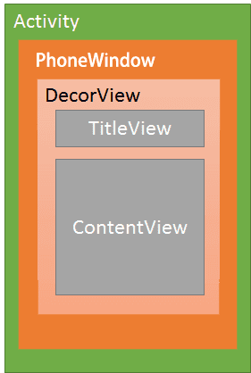
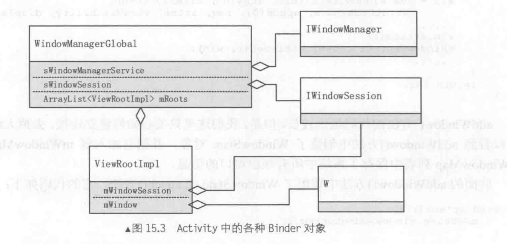
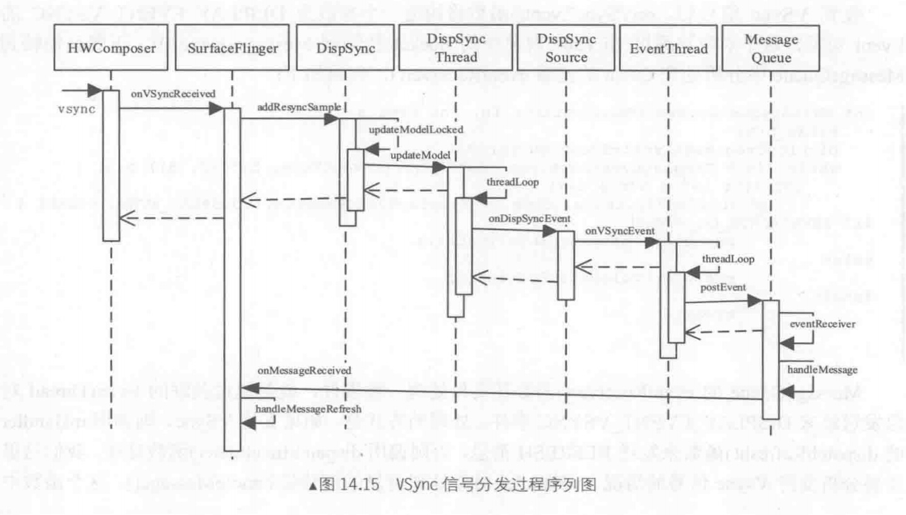
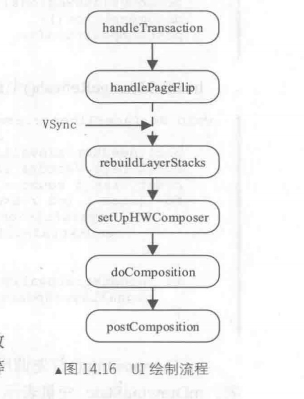
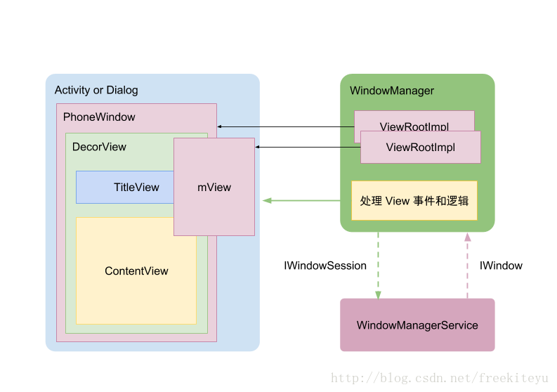
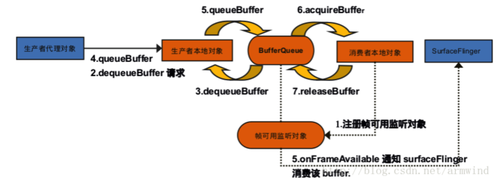

[TOC]


### 一、SurfaceFlinger
###### 1、主要类

| column | column |
|--------|--------|
|    Surface    |    持有BufferQueueProducer 用于显示    |
|    SurfaceSession    |   用于连接SurfaceFlinger     |
|    SurfaceControl    |   控制大小、显示、隐藏等 一个代理类 包装了SurfaceComposerClient     |
|    Client    |    BnBinder 用于操作Layer    |
|    SurfaceComposerClient    |    代理Composer    |
|    Composer    |    操作SF和驱动    |
|    ComposerService    |    SurfaceFlinger的BpBinder    |
|    GraphicBuffer    |    代理类 用于操作Gralloc分配用于显示的内存 lock/unlock等    |
|    GraphicBufferAllocator    |    用于分配/释放Gralloc的内存    |
|    BufferQueueCore    |    用于连接Producer和Consumer    |
|    BufferQueueProducer    |    用于和Surface交互    |
|    BufferQueueConsumer    |    用于和SurfaceFlinger交互    |

### 二、窗口





Activity中有个window对象 实例为PhoneWindow

Activity中有个mWindowManager 实例为WindowManagerImpl

WindowManagerImpl中有一个单例WindowManagerGlobal(一个进程只有一个)

WindowManagerGlobal中有个ArrayList[ViewRootImpl]
ViewRootImpl用于和WMS进行通信
ViewRootImpl中的mWindowSession为WMS端Session的BpBinder 在WindowManagerGlobal中创建
ViewRootImpl中的mWindow为Activity端W的BnBinder 用于WMS向Activity发送消息

AMS.handleResumeActivity时 WindowManagerGlobal.addView会创建ViewRootImpl 并将View作为构造参数进行关联

##### 2、WMS服务
###### 2.1 WindowToken
WindowToken 用于表示一组窗口对象
成员变量token为Binder对象 因为Binder具有唯一性
成员变量WindowList为一组WindowState 表示拥有相同WindowToken的窗口(一般为窗口和依附它的子窗口)
windowType 窗口类型

AppWindowToken继承WindowToken 代表应用窗口(activity的)

###### 2.2 窗口类型
应用窗口
子窗口		依附于应用窗口或系统窗口
系统窗口

###### 2.3 窗口Z序
WMS.WindowState代表一个Activity
DisplayContent中保存有WindowState用于显示顺序(z轴 用一个值表示 值越大越靠前)

##### 3、绘制流程
###### 3.1 vsync
https://blog.csdn.net/u013928208/article/details/82744147

信号开始于HWComposer(硬件抽象层)的vsync 然后通过EventHandler.onVSyncReceived回调到SurfaceFlinger
如果没有HWComposer 则使用线程替代
最终的分发由SF中的DispSync操作

DispSync分两条线 一条给上层app  一条给SF进行渲染
分发给上层的和SF的有个时间差 上层计算与SF渲染时间错开 提高cpu效率

DispSync会保存注册的回调接口
DispSync内部有一个线程DispSyncThread 调用threadLoop进入死循环
通过condition的阻塞控制分发(根据校准时间 控制阻塞的时间)
当vsync信号到来时 调用Cond.signal唤醒DispSyncThread

给SF进行渲染的路径:
threadLoop通过EventThread中的socket发送 最终调用MessageQueue::eventReceiver再次回调到SF中的SurfaceFlinger::onMessageReceived 进行具体的操作 refresh/invalidate

###### 3.2 图像显示过程
```cpp
void SurfaceFlinger::onMessageReceived(int32_t what) {
        case MessageQueue::TRANSACTION:
            handleMessageTransaction();
        case MessageQueue::INVALIDATE:
            handleMessageTransaction();
            handleMessageInvalidate();
        case MessageQueue::REFRESH:
            handleMessageRefresh();
}
//
bool SurfaceFlinger::handleMessageInvalidate() {
    return handlePageFlip();
}
//
void SurfaceFlinger::handleMessageRefresh() {
    preComposition();       //合成前的准备
    rebuildLayerStacks();   //重建layer堆栈
    setUpHWComposer();      //hwcomposer的设定
    doComposition();        //正式的合成处理
    doComposition();
    postComposition(refreshStartTime);//合成后期的处理
}

```
当Surface更新时 会调用
handleMessageTransaction();
handleMessageInvalidate();





### Surface


每个Window对应一个Surface，任何View都要画在Surface的Canvas上 Surface是对Buffer的进一步封装

Layer是SurfaceFlinger 进行合成的基本操作单元  一个Surface对应一个Layer
Layer其实是一个FrameBuffer，每个FrameBuffer中有FrontBuffer和BackBuffer。

app与surface关系    surface与surfaceflinger关系

补充

https://www.jianshu.com/p/8f4ef1deba26

### AppWindowToken (uml)
整体讲得可以
https://www.jianshu.com/p/38bf943766b3
Window的添加过程:
https://www.jianshu.com/p/ba53cf8694f1

需要看的
https://www.cnblogs.com/samchen2009/p/3364327.html