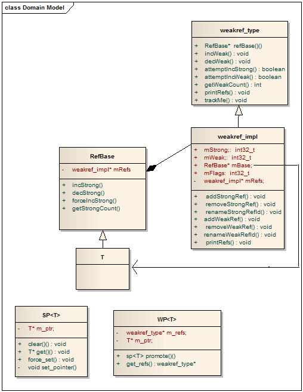
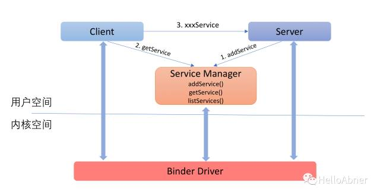
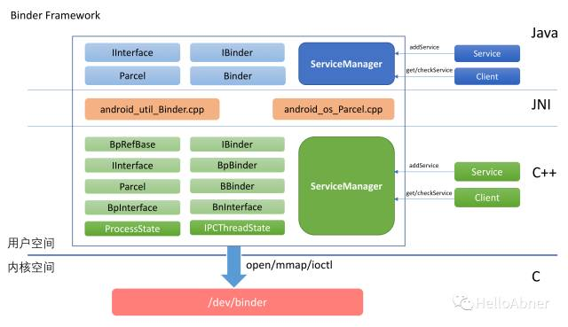
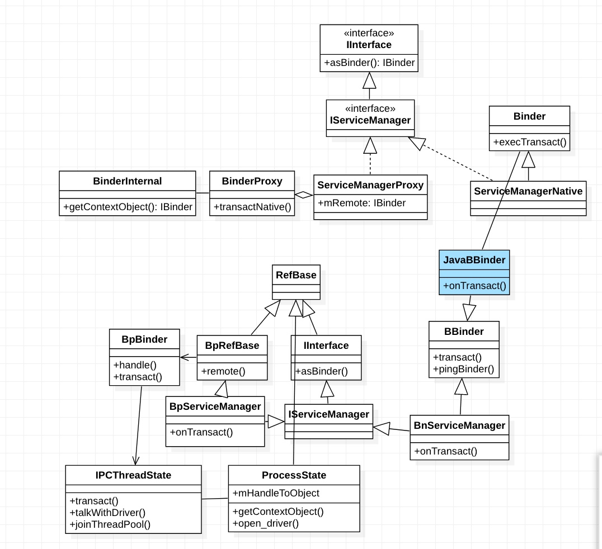
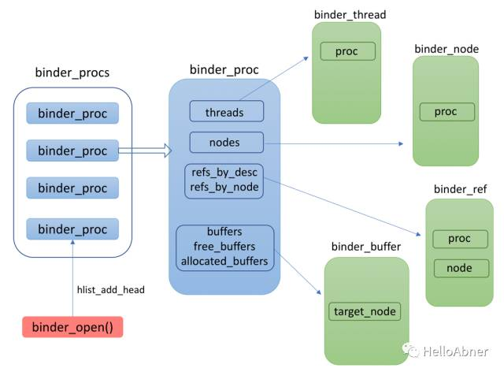
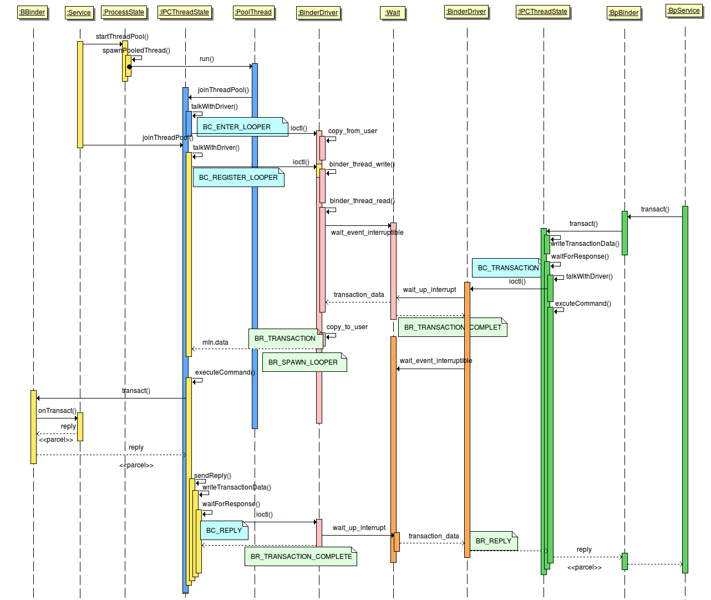

[TOC]

### 1、前置知识
##### 1.1、Parcel
parcel实现在native层 使用数组的方式管理(连续内存)   类似ArrayList
源码位于\frameworks\native\libs\binder\Parcel.cpp

##### 1.2、智能指针
c++指针存在的问题：
1. 指针未初始化
2. 没有及时delete
3. 野指针

android的智能指针不是c++原生的 而是模仿了java的强引用/弱引用等

mStrong 用于指示强引用计数
mWeak	用于指示弱引用计数
mRefs	weakref_impl实例
mBase	存储RefBase*
m_ptr	存储实际的对象

incWeak		弱引用计数+1
incStrong	强引用计数+1 内部会调用incWeak 弱引用计数+1
decStrong	强引用计数-1 弱引用计数-1		mStrong减至1时 delete this
decWeak		弱引用计数-1		mWeak减至1时 delete weakref_impl

**RefBase中的weakref_impl是实际管理强弱引用计数的功能
被管理的实例不在weakref_impl中**

> sp	强引用
> wp	弱引用
> LightRefBase	类模板 轻量级引用计数

``` cpp

class A {
public:
    void del() {
        printf("==>delete A\n");
        delete this;
    }
};

class B : A {
};

int main() {
    B *b = new B();
    ((A *) b)->del();
/*
 *  再次释放时 会报错 说明del方法以及释放了对象
    类似
    void RefBase::decStrong(const void* id) const {
        if (c == 1) {
        refs->mBase->onLastStrongRef(id);
        if ((refs->mFlags&OBJECT_LIFETIME_MASK) == OBJECT_LIFETIME_STRONG) {
            delete this;
        }
    }

    delete this  this为RefBase的子类实例 也就释放了sp/wp指向的对象
 * */
    delete b;
    return 0;
}
```



### 架构
##### 1、整体架构
SM client service java层



| 类 | 功 能 |
|-----|-----|
| IInterface | 提供服务接口与Binder之间的转换 ISM与BnBinder之间的互转 |
| BBinder | BnBinder |
| BpBinder |  |
| BpRefBase | 由BpSM继承 内部有指向BpBinder的引用 |
| ProcessState | 进程相关 打开binder并mmap BpBinder端也有|
| IPCThreadState | 管理线程 并通过talkWithDriver进行通信 |
| JavaBBinder | jni层 继承自BBinder |
| BinderInternal | java层 获取BpSM |

##### 2、传输过程
###### 2.1 传输过程的流程
2.1.1 注册过程
2.1.2 查找过程
###### 2.2 传输过程的结构体


binder_procs在内核层 为全局的
binder_proc为进程相关的
##### 3、驱动

### 2、Binder
##### 2.1、整体
驱动 结构体及整体部分讲解清晰：
https://blog.csdn.net/ming_147/article/month/2017/03
binder映射关系：
https://blog.csdn.net/jiejingguo/article/details/82497494
https://blog.csdn.net/u012439416/article/details/73135659
binder_transaction代码及内存结构
https://blog.csdn.net/chenying126/article/d粘性广播etails/78989413
经典
https://blog.csdn.net/universus/article/details/6211589
https://blog.csdn.net/happylishang/article/details/51784834

没看：https://www.cnblogs.com/lzlltmf/p/5906672.html

##### 2.2、整体流程

| 方法 | 说明 |
|--------|--------|
| refs_by_desc | 红黑树 指向binder_ref 通过handle查找。生成时 handle的值为红黑树的最小值|
| refs_by_node | 指向binder_ref 通过node查找 |
| binder_ref | binder的引用 |
| binder_node | 内部封装了BnBinder的指针 |
|    binder_buffer    |  通信过程中的数据(mmap的内存)    |
| flat_binder_object | 封装了handle/bnbinder转换的结构 |
| binder_transaction_data | 传入binder的结构 |
| binder_transaction | 传输过程中的结构 |

binder数据传输过程:
1.  当一个service向binder driver 注册时（通过flat_binder_object), driver 会创建一个binder_node, 并挂载到该service所在进程的nodes红黑树。

2.  这个service的binder线程在proc->wait 队列上进入睡眠等待。等待一个binder_work的到来。

3.  客户端的BpBinder 创建的时候，它在driver内部也产生了一个binder_ref对象，并指向某个binder_node, 在driver内部，将client和server关联起来。如果它需要或者Service的死亡状态，则会生成相应的binfer_ref_death.

4.  客户端通过transact() (对应内核命令BC_TRANSACTION)请求远端服务，driver通过ref->node的映射，找到service所在进程，生成一个binder_buffer, binder_transaction 和 binder_work 并插入服务端proc->todo队列，接着唤醒某个睡在proc->wait队列上的Binder_thread. 与此同时，该客户端线程在其线程的wait队列上进入睡眠，等待返回值。

5.  这个binder thread 从proc->todo 队列中读出一个binder_transaction, 封装成binder_transaction_data (命令为 BR_TRANSACTION) 并送到用户空间。Binder用户线程唤醒并最终执行对应的on_transact() 函数。

6.  Binder用户线程通过transact() 向内核发送 BC_REPLY命令，driver收到后从其thread->transaction_stack中找到对应的binder_transaction, 从而知道是哪个客户端线程正在等待这个返回。

7.  Driver 生成新的binder_transaction (命令 BR_REPLY), binder_buffer, binder_work, 将其插入应用线程的todo队列，并将该线程唤醒。

8.  客户端的用户线程收到回复数据，该Transaction完成。

9.  当service所在进程发生异常退出，driver 的 release函数被调到，在某位内核work_queue 线程里完成该service在内核态的清理工作（thread，buffer，node，work...), 并找到所有引用它的binder_ref, 如果某个binder_ref 有不为空的binder_ref_death, 生成新的binder_work, 送人其线程的todo 对立，唤醒它来执行剩余工作，用户端的DeathRecipient 会最终被调用来完成client端的清理工作。


> 补充：第四步将发起端binder_work插入服务端todo时 如果没有TF_ONE_WAY(单向 不需要返回)标记 则需要将结果返回给客户端
客户端发送时 binder_transaction将保存当前的进程/线程/目标进程信息 并将当前线程的transaction_stack保存在binder_transaction.from_parent中 然后将binder_transaction赋值给当前线程的transaction_stack 形成栈结构 然后将binder_work挂在服务端的todo列表上 唤醒目标线程 本线程进入睡眠

> 服务端接收到binder_transaction时 也会对transaction_stack进行栈操作 处理完任务之后将从transaction_stack中根据proc查找对应的binder_transaction 因为binder_transaction保存有客户端的binder_thread 直接将返回的binder_transaction挂在客户端的发送线程上 唤醒即可 然后出栈
> https://segmentfault.com/a/1190000017216469?utm_source=tag-newest
> https://www.cnblogs.com/lzlltmf/p/5906672.html


下面这张时序图描述了上述一个transaction完成的过程。不同的颜色代表不同的线程。注意的是，虽然Kernel和User space 线程的颜色是不一样的，但所有的系统调用都发生在用户进程的上下文里（所谓上下文，就是Kernel能通过某种方式找到关联的进程（通过Kernel的current 宏），并完成进程相关的操作，比如说唤醒某个睡眠的线程，或跟用户空间交换数据，copy_from, copy_to, 与之相对应的是中断上下文，其完全异步触发，因此无法做任何与进程相关的操作，比如说睡眠，锁等）。




##### 2.3、节点管理


1、proc节点(驱动中 即内核空间)：
https://www.jianshu.com/p/b826cbf3cb8d
驱动调用init时 初始化binder_context
在open时 杂项设备的binder_open会创建binder_proc *proc并将其加入全局binder_context中的binder_procs链表中 即每次open时创建的proc都是全局的

2、binder_context_mgr_node节点(驱动中)
在SM调用binder_become_context_manager时，最终调用binder驱动的binder_ioctl_set_ctx_mgr函数 接着调用binder_new_node创建binder_node加入proc->nodes    并将返回的node赋值给全局context->binder_context_mgr_node

3、binder_node节点及binder_ref的创建(驱动中)
1. service.addService向SM注册时 会将BnBinder的实例传入 经过层层包装 最终调用ioctl将实例传入驱动
发送到目标进程之前 驱动会检查当前进程proc.nodes是否有包含BnBinder实例的binder_node 如果没有 会根据BnBinder实例的指针生成binder_node **此时binder_node和BnBinder的实例绑定**
2. 如果是服务向SM中注册 在binder_get_ref_for_node会遍历SM的binder_ref 如果没有找到封装BnBinder的binder_node 则会在SM的binder_ref中插入本binder_node的binder_ref 即客户端负责创建服务端的binder_ref
3. 如果是Bp进程getService SM会通过字符串找到Bn在SM对应的handle并返回给Bp端 (驱动会将SM的handle转为binder_node放入Bp的任务列表(binder_work)中  Bp端读到任务由驱动创建binder_ref 并返回给上层Bp进程对应的handle)

在binder_ioctl -> binder_ioctl_write_read -> binder_thread_write -> binder_transaction
如果是BINDER_TYPE_BINDER
-> binder_translate_bindere -> binder_new_node -> binder_get_ref_for_node
如果是BINDER_TYPE_HANDLE
-> binder_translate_handle -> binder_get_ref_for_node
在binder_get_ref_for_node中会创建binder_ref


4、客户进程用户空间bpbinder的管理
```cpp
struct handle_entry {
    IBinder* binder;	//BpBinder
    //BpBinder的引用计数管理类 BpBinder间接继承自RefBase
    RefBase::weakref_type* refs;
};

ProcessState::handle_entry* ProcessState::lookupHandleLocked(int32_t handle)
{
    const size_t N=mHandleToObject.size();
    if (N <= (size_t)handle) {
        handle_entry e;
        e.binder = NULL;
        e.refs = NULL;
        //插入节点
        status_t err = mHandleToObject.insertAt(e, N, handle+1-N);
        if (err < NO_ERROR) return NULL;
    }
    //返回handle指向的handle_entry 并使其可修改
    return &mHandleToObject.editItemAt(handle);
}
```
ProcessState中通过`Vector<handle_entry> mHandleToObject`
getStrongProxyForHandle内部通过mHandleToObject保存了Client端的BpBinder  handle为vector的index值
即：每个进程(ProcessState进程单例)在用户空间都维护了一个BnBinder的引用BpBinder

补充：
binder_work
从应用程序角度来看，所有的binder调用都是同步的。但在binder driver 内部，两个进程间的交互都是异步的，一个进程产生的请求会变成一个binder_work, 并送入目标进程或线程的todo 队列里，然后唤醒目标进程和线程来完成这个请求，并阻塞等待结果。

##### 2.4、java层
https://www.jianshu.com/p/e360b00d0d29
在启动虚拟机时 会注册Binder(对应BBinder)/BinderInternal/BinderProxy(对应BpBinder)的jni

java层的binder是依照native层的binder
不同的是mRemote在java层是放在实现类的XXXProxy中 而native层则是放在BpRefBase中 用于引用计数

java层的SM为ServiceManagerNative 为抽象类 没有实例化 只有一个可用的静态方法asInterface 用于获取ServiceManagerProxy

BinderInternal.getContextObject为native方法 首先ProcessState.getContextObject(NULL)获取SM的BpBinder 然后使用jni实例化java层的BinderProxy 进行将BpBinder和BinderProxy进行关联 因为handle为NULL即0 所有是SM的BpBinder

JavaBBinder为native类 继承BBinder 主要与java的Binder进行关联 BBinder.onTransact()会回调Binder.execTransact()
JavaBBinderHolder用于管理JavaBBinder 内部会新建JavaBBinder

XXXProxy会调用BinderProxy.transactNative()发送指令
服务端BBinder.onTransact(native)会回调Binder.execTransact(java) 将调用服务端的onTransact方法进行具体的处理

##### 2.5、AIDL
```java
interface IA extends IInterface {
    //由服务端继承 实现具体的抽象方法
    abstract class Stub extends Binder implements IA {
        boolean onTransact(int code, Parcel data, Parcel reply) {
            //根据code 执行具体的方法
            this.method();
        }

        //代理端
        class Proxy implements IA {
            private IBinder mRemote;
            Proxy(IBinder remote) {
                mRemote = remote;
            }
			//用于发送指令
            void method() {
                mRemote.transact();
            }
        }

    }

    //由服务端做具体的实现
    void method();
}
```

##### 2.6、讣告
https://www.jianshu.com/p/2a46eec33c5c
服务端挂了，或者正常退出，Binder驱动会向客户端发送一份讣告，告诉客户端Binder服务挂了

在释放binder设备的时候 会发送讣告 整体类似观察者模式

1. 注册：
当创建binder_ref时 会在binder_node保存所有binder_ref的指针 注册时调用BpBinder.linkToDeath 在客户端新建binder_ref_death 并赋值给binder_ref

2. 发送：
服务端binder_realease时 会遍历binder_proc内所有的binder_node节点 将通知发送到客户端的todo列表中
客户端收到死亡通知 会调用sendObituary 进而回调reportOneDeath进行具体的实现