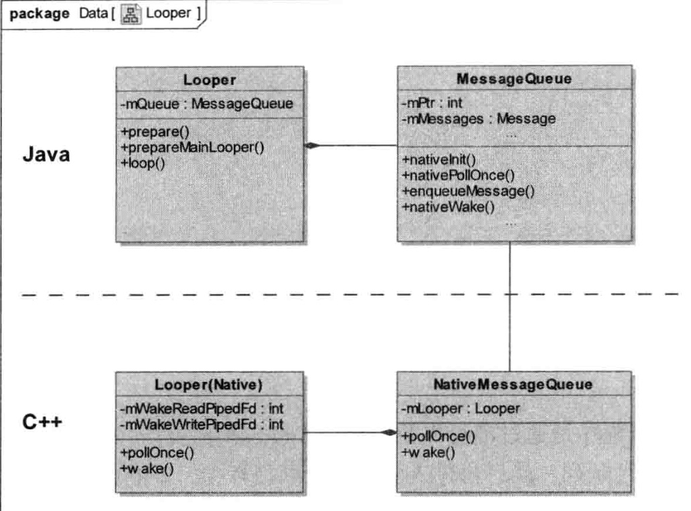
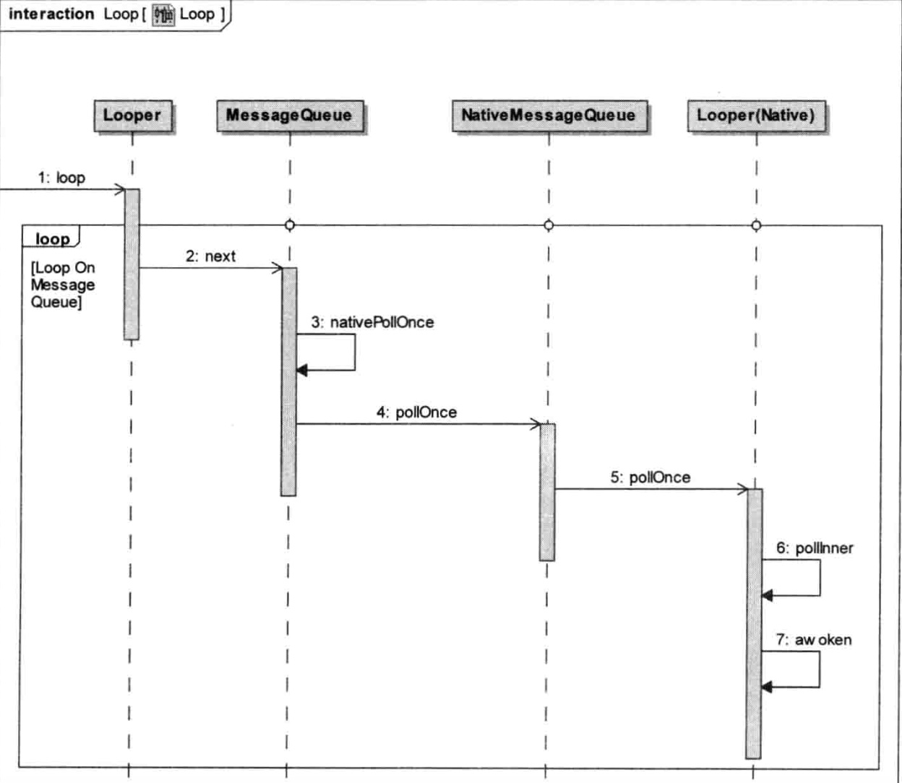
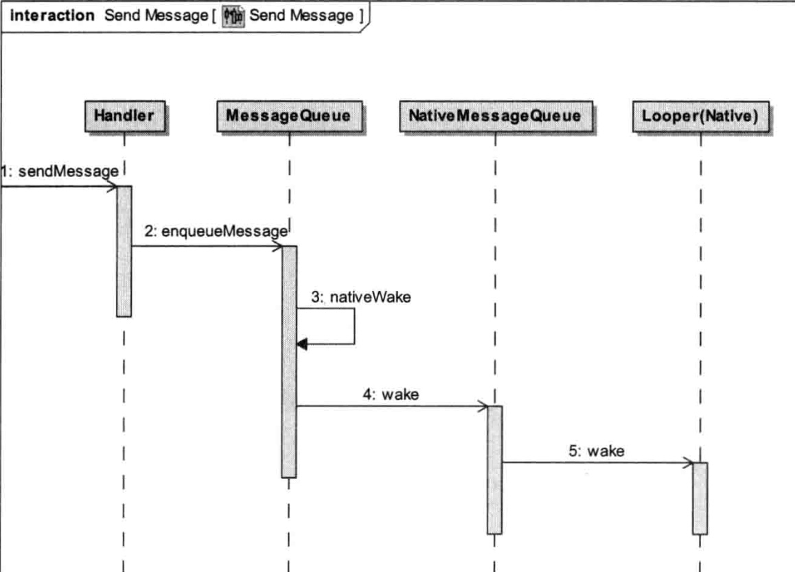
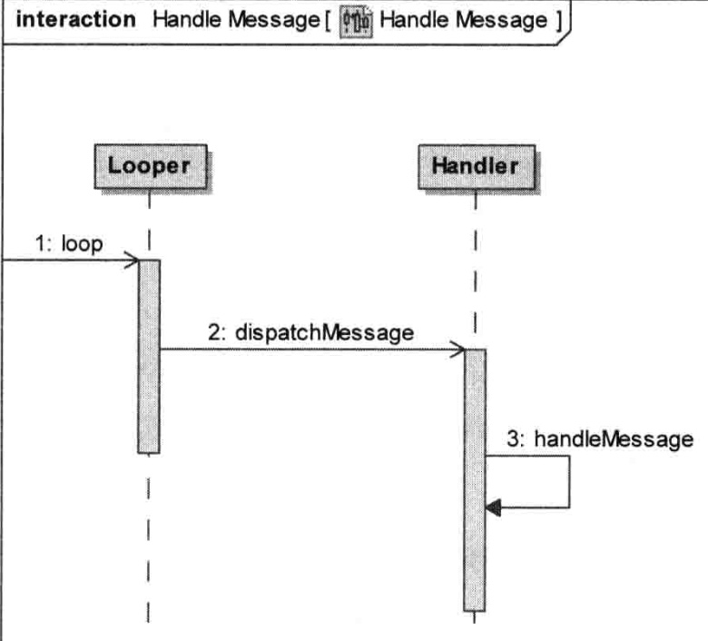

[TOC]

### 一、整体


##### 1、Looper.prepare
**Looper.prepare会new一个Looper并保存到ThreadLocal中**

Looper构造方法会new一个MessageQueue
MessageQueue构造方法调用nativeInit，new一个NativeMessageQueue，并将NMQ对象的地址通过jni保存到MessageQueue的mPtr中。

NMQ构造函数会new一个LooperNative(LN)
LN的构造方法中会创建一个pipe，创建一个epool，并监听pipe的读操作

在andriod6.1的代码中 使用了epoll替换pipe

##### 2、Looper.loop



Looper.loop获取MessageQueue，并进入死循环处理消息

首先调用MQ的next方法，进而调用nativePollOnce，传入Message.when-now。如果Message为null，传入-1。

最终调用LooperNative的pollInner,在pollInner中调用epoll_wait等待。
接下来遍历epoll，如果有读事件，则调用awoken，通过read将管道旧数据读出，然后进入阻塞状态。
如果想唤醒，需要在管道写端写数据

##### 3、handler发送消息



handler通过threadLocal获得Looper对象
发送消息为handler.sendMessageAtTime,然后调用MessageQueue的enqueueMessage根据时间规则插入队列

如果MQ为空、Message的时间0、Message的时间小于MQ的第一个消息，则将新Message插入MQ的头
如果epoll正在阻塞，则调用nativeWake唤醒
最终调用LooperNative的wake方法，向管道写数据

##### 4、上层处理

在第二步中，如果有Message,并且且已经到了执行时间，会调用message.target.dispatchMessage(message)
target为Handler，在调用MessageQueue的enqueueMessage时会被赋值。
在dispatchMessage中首先调用handleCallback方法。如果没有，则调用handler初始化时传入的callback接口

##### 5、总结
实现主要是通过native层的阻塞 在sendMessage时设置时间 会计算阻塞的时间 然后在for循环中调用message.target.dispatchMessage

Handler.enqueueMessage时 会msg.target = Handler赋值

```java
//分发时 调用handler.dispatchMessage 所以callback回调在handler所在的线程
public void dispatchMessage(Message msg) {
        //1、优先回调Message的callback   handler.post封装的
        if (msg.callback != null) {
            handleCallback(msg);
        } else {
            //2、回调Handler构造的callback
            if (mCallback != null) {
                if (mCallback.handleMessage(msg)) {
                    return;
                }
            }
            //3、回调Handler.handleMessage
            handleMessage(msg);
        }
    }
```

### 二、同步屏障
https://blog.csdn.net/asdgbc/article/details/79148180
http://www.360doc.com/content/16/0511/14/26211242_558223390.shtml

使用postSyncBarrier设置同步屏障 可以使Message.setAsynchronous为true的消息优先处理

屏障msg.target为null 当MessageQueue.next查询到msg.target=null时 会查找后续的异步Message
postSyncBarrier生成的Message相当于一个标记 本身不会处理消息

### 三、空闲线程
https://www.jianshu.com/p/94d6131a53b2

需要实现MessageQueue.IdleHandler.queueIdle 返回true表现循环 false表示执行一次
在MessageQueue阻塞期间 会运行空闲线程

原理：
如果注册了IdleHandler接口 则执行回调 然后根据queueIdle的返回值true 不阻塞线程


