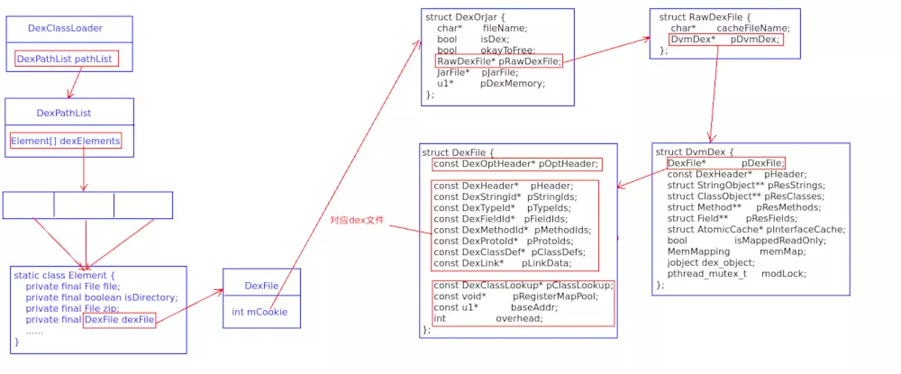
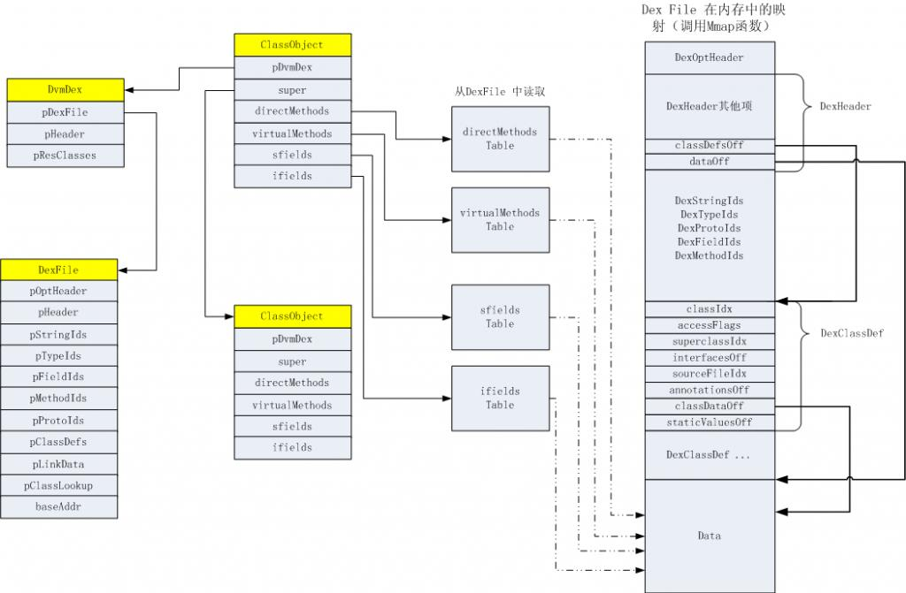

### 一、Dalvik
Zygote启动Dalvik时 会占用一部分内存 称为Zygote Heap 当执行fork时 只会复制没有使用的那部分内存 称为Active Heap 为了节省内存以及效率Zygote Heap是共用的

###### 2、dex加载过程
dex文件加载过程https://www.jianshu.com/p/c9fd64e0b934
加载器https://www.jianshu.com/p/a620e368389a

DexClassLoader继承ClassLoader 用于dex文件的加载器
内部有DexPathList DexPathList内部有Element[]数组 用于实际的加载(用于解决65535方法的问题 将dex文件分割为多个 每一个Element对应一个dex文件)

在加载完之后 最终将dex文件映射为DexFile结构体 然后将DexFile文件解析为ClassObject
新建对象时 native层的Object中有ClassObject的指针 根据ClassObject在堆中分配内存 然后强转为具体的类

### 二、ART
art虚拟机使用的是linux系统私有的ELF格式OAT文件 包含了dex文件以及根据dex文件生成的本地机器指令

查找时 根据dex的类index查找oat类的index
然后再根据dex的method index去查找oat类中method index

art中有一个class类 对应java层的Class类 内部有vtable/itable 用于方法分派

ART的实现与dalvik的实现不同 用Class描述类的内容 相当于dalvik中的ClassObject   OatDexFile对应DexFile

不错的文字 https://shuwoom.com/?cat=4

