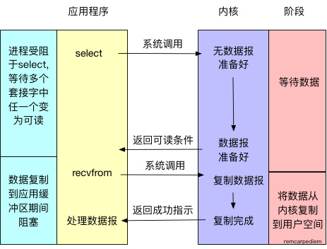

<article class="article fmt article-content" data-id="1190000017798684" data-license="">
                                

  最近在学习Java网络编程和Netty相关的知识，了解到Netty是NIO模式的网络框架，但是提供了不同的<code>Channel</code>来支持不同模式的网络通信处理，包括同步、异步、阻塞和非阻塞。学习要从基础开始，所以我们就要先了解一下相关的基础概念和Java原生的NIO。这里，就将最近我学习的知识总结一下，以供大家了解。  为了节约你的时间，本文主要内容如下：

<ul>
<li>异步，阻塞的概念</li>
<li>操作系统I/O的类型</li>
<li>Java NIO的底层实现</li>
</ul>
<h3 id="item-1">异步，同步，阻塞，非阻塞</h3>

 <strong><em>同步和异步关注的是消息通信机制</em></strong>，所谓同步就是调用者进行调用后，在没有得到结果之前，该调用一直不会返回，但是一旦调用返回，就得到了返回值，<strong><em>同步就是指调用者主动等待调用结果</em></strong>；而异步则相反，执行调用之后直接返回，所以可能没有返回值，等到有返回值时，由被调用者通过状态，通知来通知调用者．<strong>异步就是指被调用者来通知调用者调用结果就绪<strong><em>．</em></strong>所以，二者在消息通信机制上有所不同，一个是调用者检查调用结果是否就绪，一个是被调用者通知调用者结果就绪</strong>  <strong><em>阻塞和非阻塞关注的是程序在等待调用结果(消息，返回值)时的状态</em></strong>．阻塞调用是指在调用结果返回之前，当前线程会被挂起，调用线程只有在得到结果之后才会继续执行．非阻塞调用是指在不能立刻得到结构之前，调用线程不会被挂起，还是可以执行其他事情．  两组概念相互组合就有四种情况，分别是同步阻塞，同步非阻塞，异步阻塞，异步非阻塞．我们来举个例子来分别类比上诉四种情况．  比如你要从网上下载一个1G的文件，按下下载按钮之后，如果你一直在电脑旁边，等待下载结束，这种情况就是同步阻塞；如果你不需要一直呆在电脑旁边，你可以去看一会书，但是你还是隔一段时间来查看一下下载进度，这种情况就是同步非阻塞；如果你一直在电脑旁边，但是下载器在下载结束之后会响起音乐来提醒你，这就是异步阻塞；但是如果你不呆在电脑旁边，去看书，下载器下载结束后响起音乐来提醒你，那么这种情况就是异步非阻塞．

<h3 id="item-2">Unix的I/O类型</h3>

 知道上述两组概念之后，我们来看一下Unix下可用的5种I/O模型：

<ul>
<li>阻塞I/O(bloking IO)</li>
<li>非阻塞I/O(nonblocking IO)</li>
<li>多路复用I/O(IO multiplexing)</li>
<li>信号驱动I/O(signal driven IO)</li>
<li>异步I/O(asynchronous IO)</li>
</ul>

 前４种都是同步，只有最后一种是异步I/O.需要注意的是<strong><em>Java NIO依赖于Unix系统的多路复用I/O,对于I/O操作来说，它是同步I/O，但是对于编程模型来说，它是异步网络调用</em></strong>.下面我们就以系统<code>read</code>的调用来介绍不同的I/O类型．  当一个<code>read</code>发生时，它会经历两个阶段:

<ul>
<li>1 等待数据准备</li>
<li>2 将数据从内核内存空间拷贝到进程内存空间中</li>
</ul>

 不同的I/O类型，在这两个阶段中有不同的行为．但是由于这块内容比较多，而且多为表述性的知识，所以这里我们只给出几张图片来解释，感觉兴趣的同学可以去具体了解一下。

<h3 id="item-3">Java NIO的底层实现</h3>

 我们都知道Netty通过JNI的方式提供了Native Socket Transport，为什么<code>Netty</code>要提供自己的Native版本的NIO呢？明明Java NIO底层也是基于<code>epoll</code>调用(最新的版本)的．这里，我们先不明说，大家想一想可能的情况．下列的源码都来自于OpenJDK-8u40-b25版本．

<h4>open方法</h4>

 如果我们顺着<code>Selector.open()</code>方法一个类一个类的找下去，很容易就发现<code>Selector</code>的初始化是由<code>DefaultSelectorProvider</code>根据不同操作系统平台生成的不同的<code>SelectorProvider</code>，对于Linux系统，它会生成<code>EPollSelectorProvider</code>实例，而这个实例会生成<code>EPollSelectorImpl</code>作为最终的<code>Selector</code>实现．

        

        
        
        

        
<pre class="hljs java"><code>class EPollSelectorImpl extends SelectorImpl
{
    .....
    // The poll object
    EPollArrayWrapper pollWrapper;
    .....
    EPollSelectorImpl(SelectorProvider sp) throws IOException {
        .....
        pollWrapper = new EPollArrayWrapper();
        pollWrapper.initInterrupt(fd0, fd1);
        .....
    }
    .....
}</code></pre>

 <code>EpollArrayWapper</code>将Linux的epoll相关系统调用封装成了native方法供<code>EpollSelectorImpl</code>使用．

        

        
        
        

        
<pre class="hljs java"><code>    private native int epollCreate();
    private native void epollCtl(int epfd, int opcode, int fd, int events);
    private native int epollWait(long pollAddress, int numfds, long timeout,
                                 int epfd) throws IOException;</code></pre>

 上述三个native方法就对应Linux下epoll相关的三个系统调用

        

        
        
        

        
<pre class="hljs cs"><code>//创建一个epoll句柄，size是这个监听的数目的最大值．
int epoll_create(int size);
//事件注册函数，告诉内核epoll监听什么类型的事件，参数是感兴趣的事件类型，回调和监听的fd
int epoll_ctl(int epfd, int op, int fd, struct epoll_event *event);
//等待事件的产生，类似于select调用，events参数用来从内核得到事件的集合
int epoll_wait(int epfd, struct epoll_event * events, int maxevents, int timeout);</code></pre>

 所以，我们会发现在<code>EpollArrayWapper</code>的构造函数中调用了<code>epollCreate</code>方法，创建了一个epoll的句柄．这样，<code>Selector</code>对象就算创造完毕了．

<h4>register方法</h4>

 与<code>open</code>类似，<code>ServerSocketChannel</code>的<code>register</code>函数底层是调用了<code>SelectorImpl</code>类的<code>register</code>方法，这个<code>SelectorImpl</code>就是<code>EPollSelectorImpl</code>的父类．

        

        
        
        

        
<pre class="hljs java"><code>protected final SelectionKey register(AbstractSelectableChannel ch,
                                      int ops,
                                      Object attachment)
{
    if (!(ch instanceof SelChImpl))
        throw new IllegalSelectorException();
    //生成SelectorKey来存储到hashmap中，一共之后获取
    SelectionKeyImpl k = new SelectionKeyImpl((SelChImpl)ch, this);
    //attach用户想要存储的对象
    k.attach(attachment);
    //调用子类的implRegister方法
    synchronized (publicKeys) {
        implRegister(k);
    }
    //设置关注的option
    k.interestOps(ops);
    return k;
}</code></pre>

 <code>EpollSelectorImpl</code>的相应的方法实现如下，它调用了<code>EPollArrayWrapper</code>的<code>add</code>方法，记录下Channel所对应的fd值,然后将ski添加到<code>keys</code>变量中．在<code>EPollArrayWrapper</code>中有一个byte数组<code>eventLow</code>记录所有的channel的fd值.

        

        
        
        

        
<pre class="hljs cs"><code>    protected void implRegister(SelectionKeyImpl ski) {
        if (closed)
            throw new ClosedSelectorException();
        SelChImpl ch = ski.channel;
        //获取Channel所对应的fd,因为在linux下socket会被当作一个文件，也会有fd
        int fd = Integer.valueOf(ch.getFDVal());
        fdToKey.put(fd, ski);
        //调用pollWrapper的add方法,将channel的fd添加到监控列表中
        pollWrapper.add(fd);
        //保存到HashSet中，keys是SelectorImpl的成员变量
        keys.add(ski);
    }</code></pre>

 我们会发现,调用<code>register</code>方法并没有涉及到<code>EpollArrayWrapper</code>中的native方法<code>epollCtl</code>的调用,这是因为他们将这个方法的调用推迟到<code>Select</code>方法中去了.

<h4>Select方法</h4>

 和<code>register</code>方法类似,<code>SelectorImpl</code>中的<code>select</code>方法最终调用了其子类<code>EpollSelectorImpl</code>的<code>doSelect</code>方法

        

        
        
        

        
<pre class="hljs java"><code>protected int doSelect(long timeout) throws IOException {
    .....
    try {
        ....
        //调用了poll方法,底层调用了native的epollCtl和epollWait方法
        pollWrapper.poll(timeout);
    } finally {
        ....
    }
    ....
    //更新selectedKeys,为之后的selectedKeys函数做准备
    int numKeysUpdated = updateSelectedKeys();
    ....
    return numKeysUpdated;
}</code></pre>

 由上述的代码，可以看到，<code>EPollSelectorImpl</code>先调用<code>EPollArrayWapper</code>的<code>poll</code>方法,然后在更新<code>SelectedKeys</code>．其中<code>poll</code>方法会先调用<code>epollCtl</code>来注册先前在<code>register</code>方法中保存的Channel的fd和感兴趣的事件类型，然后<code>epollWait</code>方法等待感兴趣事件的生成,导致线程阻塞.

        

        
        
        

        
<pre class="hljs java"><code>int poll(long timeout) throws IOException {
    updateRegistrations(); ////先调用epollCtl,更新关注的事件类型
    ////导致阻塞，等待事件产生
    updated = epollWait(pollArrayAddress, NUM_EPOLLEVENTS, timeout, epfd);
    .....
    return updated;
}</code></pre>

 等待关注的事件产生之后(或在等待时间超过预先设置的最大时间),<code>epollWait</code>函数就会返回.<code>select</code>函数从阻塞状态恢复.

<h4>selectedKeys方法</h4>

 我们先来看<code>SelectorImpl</code>中的<code>selectedKeys</code>方法.

        

        
         publicSelectedKeys;
public Set<SelectionKey> selectedKeys() {
    ....
    return publicSelectedKeys;
}" title="" data-original-title="复制">
        

        
<pre class="hljs kotlin"><code>//是通过Util.ungrowableSet生成的,不能添加,只能减少
private Set&lt;SelectionKey&gt; publicSelectedKeys;
public Set&lt;SelectionKey&gt; selectedKeys() {
    ....
    return publicSelectedKeys;
}</code></pre>

 很奇怪啊,怎麽直接就返回<code>publicSelectedKeys</code>了,难道在<code>select</code>函数的执行过程中有修改过这个变量吗?  <code>publicSelectedKeys</code>这个对象其实是<code>selectedKeys</code>变量的一份副本,你可以在<code>SelectorImpl</code>的构造函数中找到它们俩的关系,我们再回头看一下<code>select</code>中<code>updateSelectedKeys</code>方法.

        

        
        
        

        
<pre class="hljs cs"><code>private int updateSelectedKeys() {
    //更新了的keys的个数,或在说是产生的事件的个数
    int entries = pollWrapper.updated; 
    int numKeysUpdated = 0;
    for (int i=0; i&lt;entries; i++) {
        //对应的channel的fd
        int nextFD = pollWrapper.getDescriptor(i);
        //通过fd找到对应的SelectionKey
        SelectionKeyImpl ski = fdToKey.get(Integer.valueOf(nextFD));
        if (ski != null) {
            int rOps = pollWrapper.getEventOps(i);
            //更新selectedKey变量,并通知响应的channel来做响应的处理
            if (selectedKeys.contains(ski)) {
                if (ski.channel.translateAndSetReadyOps(rOps, ski)) {
                    numKeysUpdated++;
                }
            } else {
                ski.channel.translateAndSetReadyOps(rOps, ski);
                if ((ski.nioReadyOps() &amp; ski.nioInterestOps()) != 0) {
                    selectedKeys.add(ski);
                    numKeysUpdated++;
                }
            }
        }
    }
    return numKeysUpdated;
}</code></pre>
<h3 id="item-4">后记</h3>

 看到这里,详细大家都已经了解到了NIO的底层实现了吧.这里我想在说两个问题.  一是为什么Netty自己又从新实现了一边native相关的NIO底层方法? 听听Netty的创始人是怎麽说的吧<a href="http://stackoverflow.com/questions/23465401/why-native-epoll-support-is-introduced-in-netty" rel="nofollow noreferrer" target="_blank">链接</a>。因为Java的版本使用的epoll的level-triggered模式，而Netty则希望使用edge-triggered模式，而且Java版本没有将epoll的部分配置项暴露出来，比如说TCP_CORK和SO_REUSEPORT。  二是看这么多源码,花费这么多时间有什么作用呢?我感觉如果从非功利的角度来看,那么就是纯粹的希望了解的更多,有时候看完源码或在理解了底层原理之后,都会用一种恍然大悟的感觉,比如说<code>AQS</code>的原理.如果从目的性的角度来看,那么就是你知道底层原理之后,你的把握性就更强了,如果出了问题,你可以更快的找出来,并且解决.除此之外,你还可以按照具体的现实情况,以源码为模板在自己造轮子,实现一个更加符合你当前需求的版本.  后续如果有时间,我希望好好了解一下epoll的操作系统级别的实现原理.

</article>