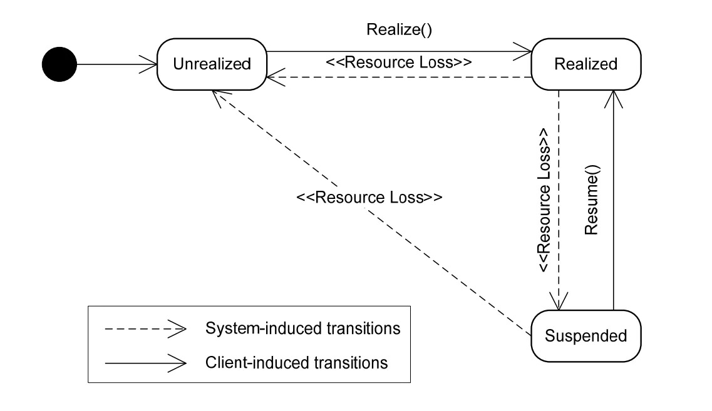

#### 一、概述
##### 1、说明
OpenSL ES 是一套针对嵌入式平台的音频功能API标准
设计目标是让应用程序开发人员能够访问高级音频功能，如3D定位音频和MIDI播放

##### 2、功能
- 基本音频播放和录制。
- 3D音频效果，包括3D定位音频。
- 音乐体验增强效果，包括低音增强和环境混响。
- 缓冲队列。

##### 3、优缺点
android端的openSL es是OpenSL ES 1.0.1 的子集 有许多功能并不支持

不支持:
- 不支持 MIDI。
- 不支持直接播放 DRM 或者 加密的内容。
- 不支持音频数据的编解码，如需编解码，需要使用 MediaCodec -API 或者第三方库。
- 在音频延时方面，相比于JAVA的 API，并没有特别明显地改进。

优势:
- 直接使用native 减少java/native内存拷贝
- 参数更加灵活
- 可以做深度优化

##### 4、OpenSL ES的状态机制



##### 5、开发流程
1. 创建接口对象
2. 设置混音器
3. 创建播放器（录音器）
4. 设置缓冲队列和回调函数
5. 设置播放状态
6. 启动回调函数
其中4和6是播放PCM等数据格式的音频是需要用到的。

###### 6、api
Engine Object 和 SLEngineItf Interface
Engine Object是OpenSL ES 里面最核心的对象，
它主要提供如下两个功能：
(1) 管理 Audio Engine 的生命周期。
(2) 提供管理接口: SLEngineItf，该接口可以用来创建所有其他的 Object 对象。
(3) 提供设备属性查询接口：SLEngineCapabilitiesItf 和 SLAudioIODeviceCapabilitiesItf，这些接口可以查询设备的一些属性信息。

创建:
```cpp
//创建
SLObjectItf engineObject;
slCreateEngine( &engineObject, 0, nullptr, 0, nullptr, nullptr );
//初始化
(*engineObject)->Realize(engineObject, SL_BOOLEAN_FALSE);
//销毁
(*engineObject)->Destroy(engineObject);


//slCreateEngine的定义
SL_API SLresult SLAPIENTRY slCreateEngine(
	//指向输出的engine对象的指针
	SLObjectItf             *pEngine,
    //可选配置数组的大小
	SLuint32                numOptions,
    //可选配置数组
	const SLEngineOption    *pEngineOptions,
    //对象要求支持的接口数目，不包含隐含的接口
	SLuint32                numInterfaces,
    //对象需要支持的接口id的数组
	const SLInterfaceID     *pInterfaceIds,
    //指定每个要求接口的接口是可选或者必须的标志位数组。如果要求的接口没有实现，创建对象会失败并返回错误码
	const SLboolean      *pInterfaceRequired
);
```

管理接口
```cpp
SLEngineItf engineEngine;
(*engineObject)->GetInterface(engineObject, SL_IID_ENGINE, &(engineEngine));
```


参考:
https://blog.csdn.net/ywl5320/article/details/78503768
