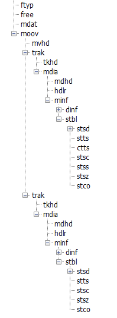

2、mp4编码流程
6、编解码流程
7、mediacodec

vipkid 猿辅导 优酷 爱奇艺 好未来 新东方

[TOC]

### 一、基础知识
###### 1、音频
采样率
声道
量化精度

###### 2、视频
码率	kbps 每秒传输的数据位数(bit)
		音频大小 = 采样率 * 位数 * 声道数
        文件大小 = (音频+视频) kbps /1024/8 * 秒
   动态码率:适合存储 不适合网络传输
   静态码率:适合网络传输 不适合存储 压缩快 占空间大

帧率	fps	每秒显示的帧数

DTS(解码时间戳)/PTS(显示时间戳)
https://blog.csdn.net/qinglongzhan/article/details/80963059
时间基：https://blog.csdn.net/bixinwei22/article/details/78770090
没有B帧的情况下 DTS/PTS顺序相同
有B帧时 因为B帧需要参考前后两帧 所以会先解码后续的P帧 才能解当前的B帧

YUV
https://www.jianshu.com/p/6a361e86ccd5
y代表亮度	uv代表色度
打包格式:每个分量交错存储 [yuv][yuv][yuv]的方式
平面格式:每个分量为一个平面 [yyyyyy][uu][vv]
分平面模式:y为一个平面 uv是一个平面且uv可以是交错或平面

yuv444 每像素32位  = rgba8888
yuv420 每像素16位

GOF	两个I帧之间的数据(不包括第二个I帧)

### 二、ffmpeg

| api | 作用 |
|--------|--------|
|   AVFormatContext     |    全局上下文    |
|   AVInputFormat     |    解复用器     |
|   AVStream     |    视音频流信息    |
|   AVCodecContext     |    编解码器上下文    |
|   AVPacket     |    解复用后/解码前的数据    |
|   AVFrame     |    原始音视频数据    |
|   AVCodec     |     编解码器信息   |
|   AVIOContext     |   带缓冲的读写操作     |
|   URLProtocol     |    操作文件(本地、网络)的结构    |
|   URLContext     |    封装了协议的结构体    |
|        |        |
|        |        |

https://blog.csdn.net/finewind/article/details/39433055

###### 2.1 AVPacket
AVPacket中的data指针存储实际的内容 AVPacket有引用计数机制AVBufferRef
av_packet_ref增加引用计数 av_packet_unref引用计数-1

###### 2.2 AVFrame
av_frame_alloc/av_frame_free  可以被重复使用

###### 2.5 弱网优化
调整分辨率、帧率
去除B帧 只留I、P帧
直接指定解码格式 不需要ffmpeg去匹配 提高了启动速度

### 三、音视频封装格式

###### 1、h264格式
https://www.jianshu.com/p/97b4dc8c7f00
https://www.jianshu.com/p/9522c4a7818d
http://www.iosxxx.com/blog/2017-08-09-从零了解H264结构.html

VCL 视频编码层 视频编解码 用于封装音视频的数据结构 包括宏块和片
NAL 网络提取层 将VCL数据映射或封装到NAL 进行网络传输

NAL = NALU头部信息 + RBSP
NAL Header包括优先级/类型  SPS/PPS/IDR等

第一帧为SPS(序列的全局参数:图像尺寸、格式)  PPS(配置信息)
IDR 为I帧 收到时会丢弃前面的参考帧 还会重新收到SPS和PPS
预测:帧内预测(也叫空间预测 I帧)和帧间预测(也叫时间预测 P/B帧)
量化:类似将模拟数据量化为数字量 减小了数据的体积
熵编码:根据符号出现的概率 将经常出现的分配为短码 不经常出现的分配长码 减少体积

1.2 udp包丢帧、乱序解决
在通过udp接收h264裸流时 会有丢包、乱序的情况
可以在接收端创建两个队列 一个用于缓存rtp包 一个用于存放有序的rtp包
有序队列会在缓存队列中根据rtp序号查找对应的rtp包
将有序队列的rtp处理为h264流 传入ffmpeg
如果有序队列中发现丢包 则将帧丢弃 会造成卡屏现象
如果发现丢包的是I帧(NALU帧头信息为5的帧) 尽量请求重传 因为I帧丢失 后续的P帧无法解析(发送端需要保留1s的数据)

###### 2、aac格式
https://www.jianshu.com/p/b5ca697535bd
压缩比高 且音效好 为了取代mp3

aac文件由帧组成
每一帧由ADTS头和音频数据组成
ADTS头包含了音频数据的信息 如采样率、通道数等信息
ADTS头由固定头信息和可变头信息组成

###### 3、mp4格式
https://blog.csdn.net/shelldon/article/details/54144409
https://www.jianshu.com/p/529c3729f357
https://www.villainhr.com/page/2017/08/21/学好%20MP4，让直播更给力

mp4由box组成 box中包含不同的信息 并以树结构的方式组织
video sample为一帧或一组连续的视频帧 audio sample为一段连续的音频
chunk	多个sample组成的单元

| 目录 | 作用 |
|--------|--------|
|    ftyp    |   版本及音视频格式     |
|    moov    |   容器 存放媒体信息     |
|    stbl    |   重要的容器 存放样本号/时间/文件位置等信息     |
|    stts    |   DTS序号映射表     |
|    stsc    |   sample和chunk的映射表     |
|    stsz    |   sample大小    |
|    stss    |   关键帧列表     |
|    mdat    |   存放具体的媒体数据     |
|        |        |

### 四、协议
##### 1、RTP/RTSP
https://www.cnblogs.com/hrhguanli/p/5056235.html

RTP 协议是基于UDP提供连续媒体数据的实时传输服务
RTSP RTP 协议的控制部分 实时监控数据传输质量，为系统提供拥塞控制和流控制

当RTP数据大于MTU时 会由底层协议任意拆包 造成很多数据包碎片 增加丢包率
RTP协议打包方案:
单NALU包	一个rtp包只有一个NALU包  NALU小于1400时使用
组合封包	一个rtp包包含多个NALU包 较小的数据使用
分片封包	将一个NALU包拆分为多个rtp包 大于1400时使用

##### 2、rtmp (基于tcp)
比较简单 清晰
https://www.jianshu.com/p/c2284659452f
https://www.jianshu.com/p/b2144f9bbe28
https://blog.csdn.net/tantion/article/details/82799145
很详细 很啰嗦
https://blog.csdn.net/handsomehong/article/details/79084967
2.1 message
rtmp使用时会将数据封装为message
message头有messageType 1-7为rtmp自身使用 8音频 9视频 15-20AMF即命令(播放等)
Stream ID消息的唯一标识 还原chuck时识别属于哪个消息

2.2 chunk
传输时 会将message拆分为chunk(udp包大小限制的原因)
Basic Header 包含stream ID和 type(控制消息头的大小以及类型)
Message Header 被发送的消息信息 字段长度由块头中的块类型来决定
Extended TimeStamp：扩展时间戳
Chunk Data：块数据

一个chunk stream 上能够跑多个message stream。message stream id在一个chunk stream下要不相等
块流大小可以配置

2.3 通信
rtmp也是用握手协议

播放等命令放在message中的AMF信息中

客户端需要发送连接的命令
再发送创建流的命令
最后发送public命令即可获得音视频的流

### 五、补充
###### 1、优化
1.1 卡顿优化
合理的帧率(默认25 ffmpeg可以设置) 码率 分辨率 关键帧间隔
使用H.265编解码

###### 2、mediacodec
https://www.jianshu.com/p/5d62a3cf0741
https://blog.csdn.net/zjfengdou30/article/details/81276154
android4.1开始提供硬编解

android音视频开发 源码
https://github.com/hejunlin2013/AVBookCode

