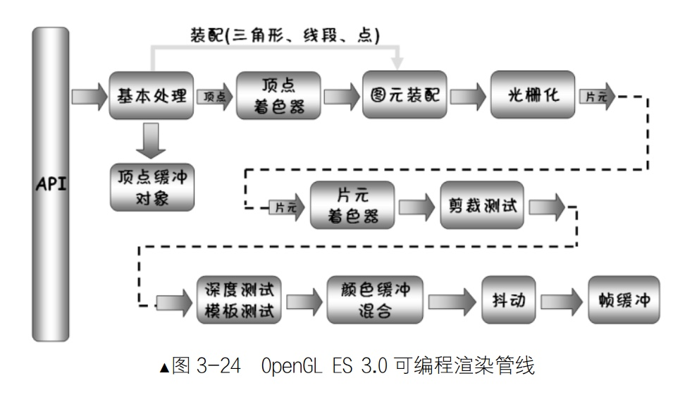
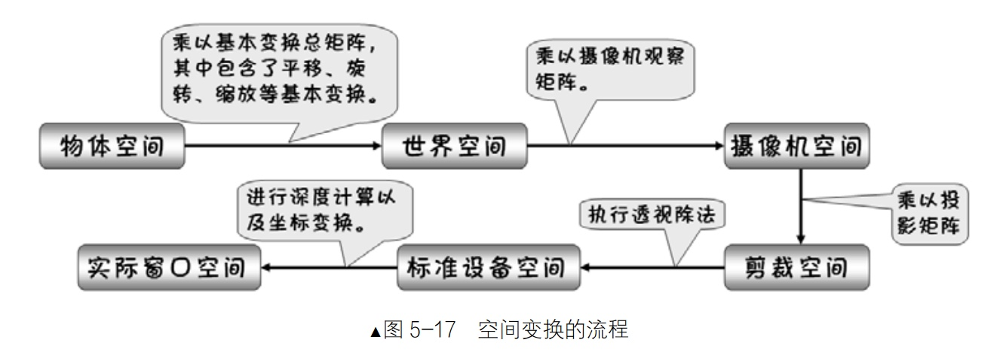
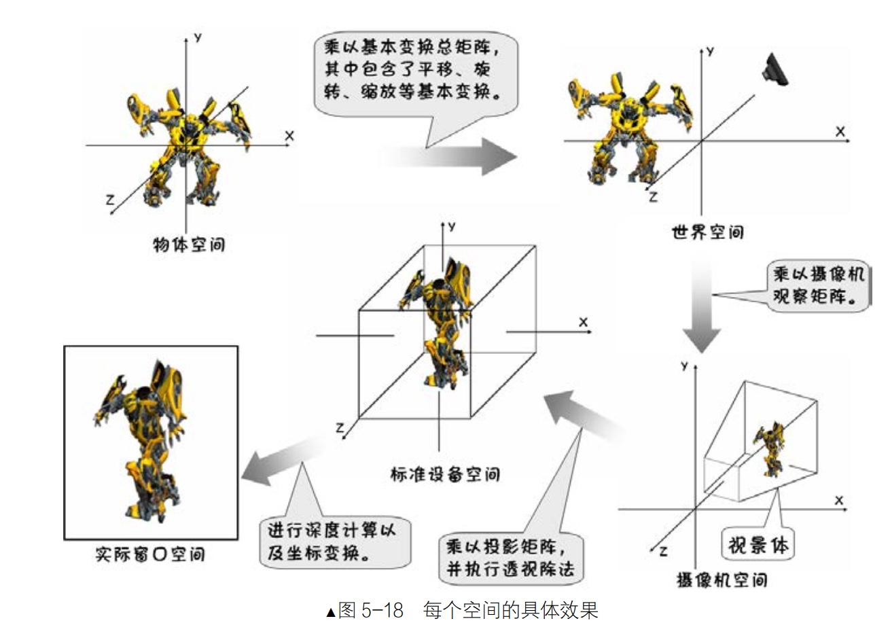

[TOC]

##### 1、基础

1. 基本处理
设定属性：顶点坐标、颜色、指定绘制方式等
2. 顶点缓冲对象
某个场景中顶点不变的情况下 可以将顶点缓存 多次绘制提高效率
3. 顶点着色器
可编程单元 执行顶点的变换、光照、材质等 每顶点执行一次
4. 图元装配
图元组装：将顶点根据设定的方式组装为图元 如三角形 线等
图元处理：主要是图元剪裁 消除半空间之外的图元(超出绘制区域的部分)
5. 光栅化
将3D顶点转为2D平面 产生片元
6. 片元着色器
可编程单元 执行片元的纹理采样、颜色汇总等 每片元执行一次
7. 裁剪测试
检查每个片元在缓冲区的位置 若在裁剪窗口中 则送入下一阶段 否则丢弃
8. 深度测试和模板测试
深度测试：输入片元的深度值与帧缓冲区对应的片元深度比较 输入片元深度小 则送入下一个阶段 否则丢弃
模板测试：将绘制区域限定在一个区域内 一般用于倒影等
9. 颜色缓冲混合
若开启混合 则根据混合因子 将输入片元与帧缓冲中的片元进行Alpha混合 否则覆盖
10. 抖动
少量颜色模拟出更多的颜色 如黑和白 可以模拟出灰色  一般不用
11. 帧缓冲
opengles在缓冲区中绘制 绘制完成才渲染到屏幕
帧缓冲由颜色缓冲、深度缓冲、模板缓冲等一套组成


##### 2、GLSL
https://blog.csdn.net/with_dream/article/details/50547496

##### 3、投影及变换
###### 3.1 相机设置
```glsl
Matrix.setLookAtM(
				//矩阵元素数组 4x4的float矩阵
				float[] rm,
                //填充起始位置偏移
                int rmOffset,
                //摄像机位置
                float eyeX, float eyeY, float eyeZ,
                //观察目标位置
                float centerX, float centerY, float centerZ,
                //up向量 (像机位置为空间中的位置 up向量为相机自身的参数)
                float upX, float upY, float upZ
                )
```

###### 3.2 投影方式
视口：屏幕上指定的绘制区域
```glsl
GLES30.glViewport(
	x, y,		//起始坐标
    width, height	//宽高
    )
```

正交投影：不遵从近大远小
```glsl
Matrix.orthoM(
	float[] m,		//4x4的float矩阵
    int mOffset,
    //near面的上下左右
    float left, float right, float bottom, float top,
    float near, float far)	//近平面/远平面距视点的距离
```

透视投影：遵从近大远小
```glsl
Matrix.frustumM(
	float[] m,		//4x4的float矩阵
    int mOffset,
    //near面的上下左右
    float left, float right, float bottom, float top,
    float near, float far)	//近平面/远平面距视点的距离
```

###### 3.3 变换
平移、缩放、旋转、切错
https://blog.csdn.net/u012964944/article/details/77824768
数学：https://www.cnblogs.com/alantu2018/p/8528299.html
https://www.jianshu.com/p/ac1b34420be7

###### 3.4 空间变换流程

1. 物体空间
物体所在的原始坐标系代表的空间(物体自身的坐标系???)

2. 世界空间
物体摆放在场景中的位置 所属的空间

3. 摄像机空间
摄像机位于坐标原点 视线沿着z轴负方向 up沿着y轴方向

4. 裁剪空间
将像机空间中视景体内的部分空间经过处理 就成为了裁剪空间

5. 标准设备空间
对裁剪空间执行透视除法(规格化)后的空间 坐标范围为-1.0~1.0

6. 实际窗口空间
屏幕设备




###### 3.5 绘制方式

| 方法 | 作用 |
|--------|--------|
|    GL_POINTS    |    绘制点    |

| 方法 | 作用 |
|--------|--------|
|    GL_LINES    |    两个点绘制一条线 且线独立    |
|    GL_LINE_LOOP    |    每两个点连接一条线 且连续闭合    |
|    GL_LINE_STRIP    |    两个点绘制一条线 且连续不闭合    |

| 方法 | 作用 |
|--------|--------|
|    GL_TRIANGLES    |    每三个点组成一个三角形 会有重复的顶点    |
|    GL_TRIANGLE_STRIP    |   对点依次绘制 N个点绘制N-2个三角形    |
|    GL_TRIANGLE_FAN    |    一个点作为中心 其他点作为边缘点    |

###### 3.6 顶点法与索引法
顶点法：使用传入的顶点直接绘制 glDrawArrays
索引法：使用索引传入顶点 减少重复顶点	glDrawElements glDrawRangeElements

###### 3.7 背面裁剪
三角形的顶点按逆时针绘制为正面 开启背面裁剪 则摄像机会观察其正面
```java
//开启背部裁剪
GLES30.glEnable(GLES30.GL_CULL_FACE);
//设置裁剪模式
GLES30.glFrontFace(GLES30.GL_CCW/GL_CW);
```

##### 4、光照
###### 4.1、物体光
1. 环境光
环境光:从四面八方照射到物体上，所有地方的光都很均匀。典型的是太阳光。
`环境光照结果=材质的反射系数 x 环境光强度`

2. 散射光
光线来自某个方向，但在物体表面上向各个方向上反射，无论在何处观察，散射光看上去亮度都相同。
`散射光照结果=材质的反射系数 x 环境光强度 x max(0, dot(N, L))`
N:法向量 L:光源向量

3. 镜面光
表面光滑的物体，不只有漫反射，还有镜面反射效果，如玻璃球
`镜面光照结果=材质的反射系数 x 环境光强度 x power(max(0, dot(N, normalise(L + E))), shininess)`
N:法向量 L:光源向量 E:相机向量 shininess:粗糙度，值越小越光滑

###### 4.2、光源
定向光:类似白炽灯，固定在某个点向四周发散光线，所以球面的漫反射和镜面反射的角度各不相同。给定光源的情况下，不同位置的物体产生的光照效果不同

定位光:类似太阳光，所有的光线都是平行照射到物体，给定光源的情况下，不同位置的物体产生的光照效果相同

###### 4.3、光照的每顶点计算与光照的每片元计算
每顶点计算:在顶点着色器中计算最终光照强度，效率比较高
将光照计算放在顶点着色器中

每片元计算:在片元着色器中计算最终光照强度，效率比较细腻
将光照计算放在片元着色器中

##### 5、纹理
###### 5.1 色彩通道组合
`GLES30.glTexParameterf(GLES30.GL_TEXTURE_2D, GLES30.GL_TEXTURE_SWIZZLE_R, GLES30.GL_BLUE);`
将纹理颜色分量(第三个参数)映射(替换)到纹理缓存中的颜色分量(第二个参数)

###### 5.2 纹理拉伸方式
图片不足以填充时 纹理的拉伸方式
```java
//x轴方向 纹理为s轴
GLES30.glTexParameterf(GLES30.GL_TEXTURE_2D, GLES30.GL_TEXTURE_WRAP_S, GLES30.GL_CLAMP_TO_EDGE);
//y轴方向 纹理为t轴
GLES30.glTexParameterf(GLES30.GL_TEXTURE_2D, GLES30.GL_TEXTURE_WRAP_T, GLES30.GL_CLAMP_TO_EDGE);

GLES30.GL_CLAMP_TO_EDGE	//拉伸
GLES30.GL_REPEAT		//重复拉伸
GLES30.GL_MIRRORED_REPEAT	//镜像拉伸
```

###### 5.3 纹理采样
```java
GLES30.glTexParameterf(GLES30.GL_TEXTURE_2D, GLES30.GL_TEXTURE_MIN_FILTER, GLES30.GL_NEAREST);
        GLES30.glTexParameterf(GLES30.GL_TEXTURE_2D, GLES30.GL_TEXTURE_MAG_FILTER, GLES30.GL_LINEAR);
//采样方式
GLES30.GL_NEAREST	//最近采样点	计算量小 颜色边界明显 小图放大时会有锯齿
GLES30.GL_LINEAR	//线性采样点 计算量大 颜色边界会模糊
GLES30.GL_TEXTURE_MIN_FILTER	//大图显示为小图元
GLES30.GL_TEXTURE_MAG_FILTER	//小图显示为大图元
```

###### 5.4 多重纹理/过程纹理
多重纹理：对同一个图元采用多幅纹理图
过程纹理：多重纹理边界的平滑过程

###### 5.5 压缩纹理
图片加载为纹理占用内存过大 如果纹理过多使用压缩纹理
opengles使用ETC2的压缩纹理格式

###### 5.6 点精灵
绘制大量的点纹理 主要用于粒子系统
主要使用gl_PointCoord

##### 6、3D模型加载
解析obj文件中的顶点、法向量等信息 再加载绘制

##### 7、混合与雾
7.1 混合：
将进入帧缓冲的片元与已有片元按照比例加权计算出最终的颜色值

| 方式 | 说明 |
|--------|--------|
|    GL_FUNC_ADD    |    源与目标分量加权    |
|	GL_FUNC_SUBTRACT	|	源与目标分量相减	|
|	GL_FUNC_REVERSE_SUBTRACT	|	目标与源分量相减	|
|	GL_MIN	|	取分量较小值	|
|	GL_MAX	|	取分量较大值	|

7.2 雾：
根据数学模型 计算雾化因子

##### 8、标志板、天空盒、镜像
###### 8.1 标志板
对于复杂的物体 如树 建立模型过于复杂
可以建立2D图元 让2D图元始终面对相机 可以显得更真实

###### 8.2 灰度图
用于绘制地形

###### 8.3 天空盒
让相机处于天空盒内部

##### 9、剪裁
###### 9.1 裁剪测试
绘制在指定矩形区域 用于在屏幕上绘制主区域和次区域
```java
==>绘制主窗口
GLES30.glEnable(GL10.GL_SCISSOR_TEST); //启用剪裁测ត
GLES30.glScissor(0,0,100,200); //设置区۫
==>绘制次区域
GLES30.glDisable(GL10.GL_SCISSOR_TEST);	//禁用剪裁测ត
```

###### 9.2 Alpha测试
绘制片元时 检测其Alpha值 如果满足条件测试通过 则绘制 否则丢弃
可以为任意形状

###### 9.3 模板测试
类似蒙版 将图元限定在一个不规则图形中 超出图形的图元不显示
```java
//清除模板缓冲
GLES30.glClear(GLES30.GL_STENCIL_BUFFER_BIT);
//模板测试
GLES30.glEnable(GLES30.GL_STENCIL_TEST);
//设置模板测试参数
GLES30.glStencilFunc(GLES30.GL_ALWAYS, 1, 1);
//设置模板测试后的操作
GLES30.glStencilOp(GLES30.GL_KEEP, GLES30.GL_KEEP, GLES30.GL_REPLACE);
//禁用模板测试
GLES30.glDisable(GLES30.GL_STENCIL_TEST);
```

###### 9.4 任意裁剪平面
只绘制图元的任意一部分

##### 10、缓冲区对象
###### 10.1 顶点缓冲区 (VBO)
数组缓冲区对象：顶点相关的数据，顶点坐标、纹理坐标
元素数组缓冲区对象：图元的组装索引数据 索引法时使用

方法都有许多选项值：
```java
void glGenBuffers(GLsizei n,	//创建缓冲对象
    GLuint * buffers);

void glBindBuffer(GLenum target,	//绑定缓冲区
    GLuint buffer);

void glBufferData(GLenum target,	//向指定缓冲中送入数据
    GLsizeiptr size,
    const GLvoid * data,
    GLenum usage);

//向指定缓冲中送入部分数据进行初始化或者更新
void glBufferSubData(GLenum target,
    GLintptr offset,
    GLsizeiptr size,
    const GLvoid * data);

void glDeleteBuffers(GLsizei n,	//删除指定的缓冲区对象
    const GLuint * buffers);

//查询指定缓冲区信息
public static void glGetBufferParameteriv (int target, int pname, IntBuffer params)
```

###### 10.2 顶点数组对象 (VAO)
VAO可以绑定多个VBO
glGenVertexArrays：创建新的顶点数组对象
glBindVertexArray：绑定指定的顶点数组对象，以便对指定的顶点数组对象进行设置或使用

###### 10.3 一致缓冲区对象
一致变量：uniform修饰 在整个绘制过程中都保持不变 相当于全局变量
宿主语言(如java)将值传入渲染管线时 需要一致缓冲区对象
glGetUniformBlockIndex
glGetActiveUniformBlock
glGetActiveUniformBlockiv
glBindBufferRange

###### 10.4 映射缓冲区对象
使用映射(共享内存)的方式 减少内存的复制次数 对于频繁变动的数据效率更高
glMapBufferRange
glUnmapBuffer
glFlushMappedBufferRange

###### 10.5 其他缓冲区对象
复制缓冲区对象：缓冲区间的数据复制操作	glCopyBufferSubData
颜色缓冲区复制到纹理

###### 10.6 帧缓冲与渲染缓冲
帧缓冲(FrameBuffer)由颜色、深度、模板附件组成
渲染缓冲为图像内存 用于向帧缓冲提供数据

###### 10.7 多重渲染目标
同时渲染到多个颜色缓冲，向不同的颜色缓冲中送入渲染结果的不同方面

首先需要创建一个自定义的帧缓冲，并绑定到此帧缓冲。
接着可以创建并初始化一批纹理，总数量等于要输出的不同渲染结果方面的数量，并且
不能超过系统的最大限制数。
然后将这一批纹理一一连接到自定义帧缓冲中的不同颜色附件中。
接着在绘制时正常绘制前调用 glDrawBuffers 方法设置要输出的颜色附件。
最后在片元着色器中定义多个输出变量一一对应到要输出的颜色附件。

##### 11、骨骼动画